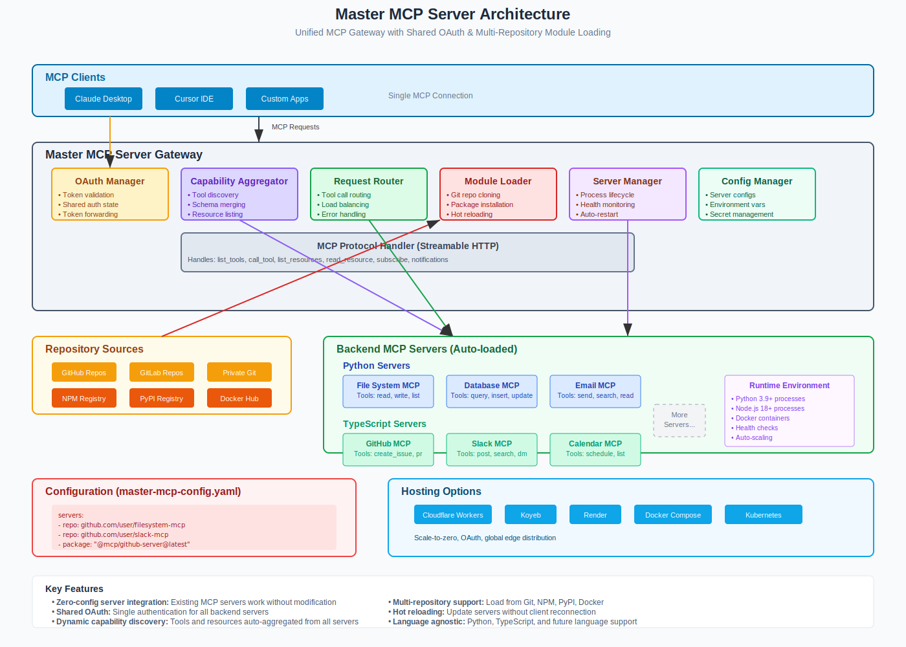

# Master MCP Server (Phase 11 — Final)

Master MCP Server aggregates multiple MCP servers behind a single, secure endpoint. It provides configuration-driven module loading, unified capability discovery, request routing with resilience, and first-class OAuth flows for multi-backend authentication.

This is Phase 11 (Final): the full implementation is complete with documentation, examples, and deployment recipes.

## Highlights

- Aggregates multiple MCP servers with tool/resource discovery and namespacing
- OAuth support: master token pass-through, delegated provider flows, proxy refresh
- Config-driven setup with JSON/YAML, schema validation, and secret resolution
- Resilient routing: load-balancing, retries with backoff/jitter, circuit-breakers
- Cross-platform: Node.js server and Cloudflare Workers runtime
- Production-ready deployment: Docker, Cloudflare Workers, Koyeb
- Testing strategy and CI-ready structure

## Quick Start (Node.js)

1) Install dependencies (requires network):

```plaintext
npm ci
```

2) Configure environment (copy and edit):

```plaintext
cp .env.example .env
```

3) Run in dev mode:

```plaintext
npm run dev
```

4) Health and Metrics:

- `GET /health` → `{ ok: true }`
- `GET /metrics` → basic system metrics

5) MCP endpoints (HTTP gateway):

- `POST /mcp/tools/list`
- `POST /mcp/tools/call` with `{ name, arguments }`
- `POST /mcp/resources/list`
- `POST /mcp/resources/read` with `{ uri }`

See `docs/` for full guides and end-to-end examples.

## Documentation

- Docs index: `docs/index.md`
- Getting started: `docs/getting-started/overview.md`
- Guides: `docs/guides/*`
- API reference: generated into `docs/api/reference/` (see below)
- Configuration reference: `docs/configuration/*`
- Deployment: `docs/deployment/*`
- Troubleshooting: `docs/troubleshooting/*`
- Contributing: `docs/contributing/*`

## Generate API Docs

We use TypeDoc (Markdown) to generate API docs from TypeScript.

1) Install (requires network):

```plaintext
npm i -D typedoc typedoc-plugin-markdown
```

2) Generate docs:

```plaintext
npm run docs:api
```

Outputs to `docs/api/`.

## Examples

Working examples live in `examples/`:

- Basic Node: `examples/basic-node`
- Cloudflare Worker: `examples/cloudflare-worker`
- Advanced Routing: `examples/advanced-routing`
- OAuth Delegation: `examples/oauth-delegation`
- Testing Patterns: see `/tests` and `docs/examples/testing.md`

Each example has a README with run instructions.

## Deployment

- Docker: `deploy/docker/*` and top-level `Dockerfile` / `docker-compose.yml`
- Cloudflare Workers: `deploy/cloudflare/*` with `wrangler.toml`
- Koyeb: `deploy/koyeb/koyeb.yaml`
- CI/CD examples: see `docs/deployment/cicd.md`

## Architecture



## Contributing & Support

- See `docs/contributing/*` for development workflow and guidelines
- See `docs/troubleshooting/index.md` for solutions
- Open an issue or discussion for help and ideas

## License

See `LICENSE`. This repository currently uses UNLICENSED for private/internal use.
