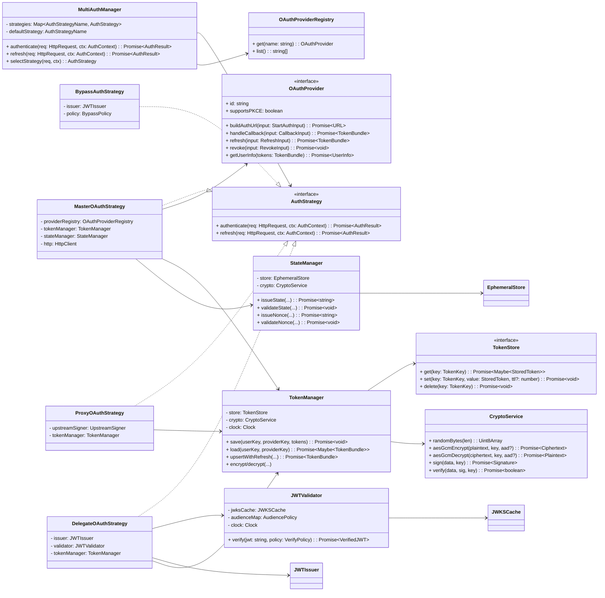

# Master MCP Server — Phase 2 Authentication Architecture

This document specifies the Phase 2 authentication system for the Master MCP Server, building on Phase 1 foundations and the researcher agent’s findings. It focuses on a pluggable, testable, and cross-platform design suitable for both Node.js (server/process) and edge/serverless runtimes (e.g., Cloudflare Workers).


## Goals and Scope
- Multi-strategy authentication orchestrated via a strategy pattern (master_oauth, delegate_oauth, bypass_auth, proxy_oauth).
- Pluggable OAuth providers behind a clean abstraction.
- Cross-platform token management with storage backends (in-memory, KV, Redis, Durable Objects) and at-rest encryption.
- Robust JWT validation and token refresh flows, compatible with Node.js and Workers.
- OAuth delegation and proxy authentication flows for multi-service topologies.
- Security patterns for PKCE, state/nonce, token protection, key rotation, and SSRF/redirect validation.
- High testability via interface-first design, inversion of control, and deterministic utilities.


## High-Level Architecture




## Strategy Pattern: MultiAuthManager

- Strategies: `master_oauth`, `delegate_oauth`, `proxy_oauth`, `bypass_auth`.
- Selection: based on configuration and request attributes (e.g., route, headers, tenant, feature flag).
- Contract: All strategies implement `AuthStrategy` with `authenticate` and `refresh` methods.
- Testability: Provide a minimal `HttpRequest` and `AuthContext` interface decoupled from any framework.

TypeScript interface sketch:

```ts
export type AuthStrategyName = 'master_oauth' | 'delegate_oauth' | 'proxy_oauth' | 'bypass_auth';

export interface HttpRequest { method: string; url: string; headers: Record<string, string>; body?: Uint8Array | object | null; }
export interface HttpResponse { status: number; headers: Record<string, string>; body?: Uint8Array | string | object; }
export interface AuthContext { env: Record<string, unknown>; tenant?: string; userKey?: string; provider?: string; cf?: unknown; node?: unknown; }

export interface AuthResult { ok: boolean; user?: UserInfo; session?: Session; redirect?: string; error?: string; responseOverride?: HttpResponse }

export interface AuthStrategy {
  authenticate(req: HttpRequest, ctx: AuthContext): Promise<AuthResult>;
  refresh(req: HttpRequest, ctx: AuthContext): Promise<AuthResult>;
}

export class MultiAuthManager {
  constructor(
    private readonly strategies: Map<AuthStrategyName, AuthStrategy>,
    private readonly defaultStrategy: AuthStrategyName,
    private readonly selector: (req: HttpRequest, ctx: AuthContext) => AuthStrategyName = () => defaultStrategy
  ) {}

  selectStrategy(req: HttpRequest, ctx: AuthContext) {
    const name = this.selector(req, ctx);
    const strat = this.strategies.get(name);
    if (!strat) throw new Error(`Unknown strategy: ${name}`);
    return strat;
  }

  authenticate(req: HttpRequest, ctx: AuthContext) { return this.selectStrategy(req, ctx).authenticate(req, ctx); }
  refresh(req: HttpRequest, ctx: AuthContext) { return this.selectStrategy(req, ctx).refresh(req, ctx); }
}
```

Strategy responsibilities:
- master_oauth: Full OAuth/OIDC Auth Code with PKCE, storing tokens, issuing session.
- delegate_oauth: Accepts a JWT from a trusted upstream (delegation), validates, optionally mints a scoped downstream token.
- proxy_oauth: Acts as a reverse proxy authenticator; resolves stored tokens, refreshes as needed, signs upstream request.
- bypass_auth: Development/maintenance mode; generates an ephemeral signed session with strict policy and audit.

Strategy selection sequence (example):


## OAuth Provider Architecture

Abstraction decouples provider-specific details (endpoints, scopes, claims mapping) from core logic.

```ts
export interface OAuthProvider {
  readonly id: string; // e.g., 'github', 'google', 'azure', 'okta'
  readonly supportsPKCE: boolean;

  buildAuthUrl(input: {
    redirectUri: string;
    state: string;
    nonce?: string; // for OIDC
    scope: string[];
    codeChallenge?: string;
    prompt?: string;
    extraParams?: Record<string, string>;
  }): Promise<URL>;

  handleCallback(input: {
    redirectUri: string;
    code: string;
    codeVerifier?: string;
  }): Promise<TokenBundle>;

  refresh(input: { refreshToken: string; scope?: string[] }): Promise<TokenBundle>;
  revoke(input: { accessToken?: string; refreshToken?: string }): Promise<void>;
  getUserInfo(tokens: TokenBundle): Promise<UserInfo>;
}

export interface OAuthProviderRegistry {
  get(name: string): OAuthProvider;
  list(): string[];
}
```

- BaseProvider: Shared helpers for standard OAuth 2.0 and OIDC, including `oauth4webapi` integration.
- Concrete providers: `GithubProvider`, `GoogleProvider`, `AzureADProvider`, `OktaProvider`.
- Extensibility: New providers only implement the interface; no changes to strategies.
- Dependencies: Prefer spec-compliant `oauth4webapi` for token/authorize requests and discovery; use `jose` for JWT work.

Provider discovery and JWKS:
- For OIDC providers, use `.well-known/openid-configuration` to discover endpoints and JWKS URI.
- Cache provider metadata and JWKS with TTL and background refresh.


## Token Manager and Token Storage Abstraction

TokenManager encrypts, stores, loads, and refreshes provider tokens. It isolates persistence from business logic.

```ts
export interface TokenBundle {
  accessToken: string;
  refreshToken?: string;
  expiresAt?: number; // epoch seconds
  tokenType?: string; // 'Bearer'
  scope?: string[];
  idToken?: string; // when OIDC
  meta?: Record<string, unknown>; // provider extras
}

export interface StoredToken {
  ciphertext: Uint8Array; // encrypted JSON of TokenBundle
  iv: Uint8Array; // AES-GCM IV
  aad?: Uint8Array; // Additional Authenticated Data
  createdAt: number;
  expiresAt?: number; // mirror for TTL prefiltering
  version: number; // for migration/rotation
}

export interface TokenKey {
  userKey: string; // tenant-scoped user unique key
  providerId: string; // e.g., 'github'
}

export interface TokenStore {
  get(key: TokenKey): Promise<StoredToken | null>;
  set(key: TokenKey, value: StoredToken, ttlSeconds?: number): Promise<void>;
  delete(key: TokenKey): Promise<void>;
}

export class TokenManager {
  constructor(private store: TokenStore, private crypto: CryptoService, private clock: Clock) {}

  async save(key: TokenKey, bundle: TokenBundle, aad?: Uint8Array) {
    const { ciphertext, iv } = await this.crypto.aesGcmEncrypt(new TextEncoder().encode(JSON.stringify(bundle)), await this.dataKey(), aad);
    const sts: StoredToken = { ciphertext, iv, aad, createdAt: this.clock.now(), expiresAt: bundle.expiresAt, version: 1 };
    const ttl = bundle.expiresAt ? Math.max(0, bundle.expiresAt - this.clock.now()) : undefined;
    await this.store.set(key, sts, ttl);
  }

  async load(key: TokenKey, aad?: Uint8Array): Promise<TokenBundle | null> {
    const sts = await this.store.get(key);
    if (!sts) return null;
    const pt = await this.crypto.aesGcmDecrypt(sts, await this.dataKey(), aad);
    return JSON.parse(new TextDecoder().decode(pt));
  }

  async upsertWithRefresh(key: TokenKey, provider: OAuthProvider): Promise<TokenBundle | null> {
    const current = await this.load(key);
    if (!current) return null;
    if (needsRefresh(current, this.clock.now())) {
      if (!current.refreshToken) return current; // cannot refresh; let caller decide
      const next = await provider.refresh({ refreshToken: current.refreshToken, scope: current.scope });
      // carry-forward scope and idToken if present
      const merged: TokenBundle = { ...current, ...next, scope: next.scope ?? current.scope };
      await this.save(key, merged);
      return merged;
    }
    return current;
  }

  private async dataKey(): Promise<CryptoKey> { /* resolved via KeyProvider/Keystore */ throw new Error('impl'); }
}
```

TokenStore implementations:
- InMemoryTokenStore: For tests and local dev.
- KVTokenStore: Cloudflare KV namespace with `put/get/delete` and TTL; namespacing by tenant and provider.
- RedisTokenStore: Uses Redis with `SETEX` and binary-safe values.
- DurableObjectTokenStore: Durable Objects for strong consistency (reads after writes) and per-user sharding.

Design notes:
- All stores operate on opaque `StoredToken` blobs (encrypted in TokenManager), ensuring at-rest encryption across backends.
- Key derivation and rotation handled by CryptoService/KeyStore (see Security).
- Avoids storing raw tokens in logs or metrics; all observability uses hashed/tokenized IDs.


## JWT Validation and Refresh

Library choice:
- Use `jose` across Node.js and Workers for signing, verifying, JWK/JWKS, and JWE if needed.
- Avoid `jsonwebtoken` (Node-only, callback-first, no Workers support). This addresses Phase 1 recommendations about jose vs jsonwebtoken.

Validator design:

```ts
import { createRemoteJWKSet, jwtVerify, JWTPayload } from 'jose';

export interface VerifyPolicy {
  issuer: string | string[];
  audience: string | string[];
  clockToleranceSec?: number;
  requiredClaims?: string[]; // e.g., ['sub','exp','iat']
}

export class JWTValidator {
  constructor(private fetcher: (url: string) => Promise<Response>, private cache: JWKSCache, private clock: Clock) {}

  async verify(jwt: string, policy: VerifyPolicy): Promise<{ payload: JWTPayload, protectedHeader: any }>{
    const { iss } = decodeHeaderless(jwt);
    const jwksUrl = await this.cache.resolveJwksUrl(iss);
    const JWKS = createRemoteJWKSet(new URL(jwksUrl), { fetcher: this.fetcher, cooldownDuration: 60_000 });
    const { payload, protectedHeader } = await jwtVerify(jwt, JWKS, {
      issuer: policy.issuer,
      audience: policy.audience,
      clockTolerance: policy.clockToleranceSec ?? 5,
    });
    ensureRequiredClaims(payload, policy.requiredClaims);
    return { payload, protectedHeader };
  }
}
```

Refresh workflow:
- On protected request, load tokens, validate access token if it is a JWT (OIDC) and optionally inspect `exp`.
- If expiring soon or expired, use provider.refresh with `refresh_token`.
- Save refreshed bundle atomically; retry with backoff on provider/network errors.
- Prevent refresh stampedes with per-key mutex (e.g., DO lock, Redis SETNX lock, or in-memory lock depending on platform).

Refresh sequence:


## OAuth Delegation and Proxy Flows

Two advanced flows:
- Delegation: Master receives a user session, validates it, then mints a delegated JWT for downstream services with scoped claims.
- Proxy: Master acts as a reverse proxy, attaching/refreshing provider tokens to upstream requests.

Delegation (Master -> Delegate) sequence:


Proxy OAuth sequence:


## Security Patterns

- PKCE: Use S256 code challenge for all authorization code flows.
- State: Cryptographically strong `state` per auth request. Two options:
  - Stateless: Encrypted+authenticated state token (AES-GCM or JWE with `dir`/`A256GCM`) containing nonce, redirectTo, providerId, and issuedAt. Signed/bound to session cookie via AAD.
  - Stateful: Store random state in KV/DO with TTL (e.g., 10 minutes); include a reference in the cookie to bind browser and storage entry.
- Nonce: For OIDC, issue and validate nonce, bound to state and user agent.
- Token encryption at rest: TokenManager encrypts TokenBundle using AES‑GCM with a 256-bit symmetric key derived from a master secret via HKDF. Store iv + ciphertext; use per-record random IV.
- Key management: KeyStore abstraction offering active and previous keys for rotation. Rotate periodically; support decrypt with old keys, encrypt with new key.
- Cookie/session hardening (when applicable):
  - HttpOnly, Secure, SameSite=Lax (or Strict for sensitive endpoints).
  - Short-lived session cookie; refresh token kept server-side only.
  - Bind session to user agent and IP heuristics where appropriate (tolerate NAT/CDN changes with care).
- Redirect allowlist: Validate `redirect_uri` against configured allowlist per provider/tenant to prevent open redirect.
- SSRF and metadata protection: Provider URLs are static/allowlisted; no user-controlled endpoints.
- Scope minimization: Request only necessary scopes per provider; persist scopes.
- Replay protection: Nonce/state binding; enforce one-time use with TTL store.
- Rate limiting: Apply per-IP and per-user limits to auth start and callback endpoints.
- Auditing: Log auth events with privacy-safe fields (hash userKey, providerId, outcome, error codes). Avoid token contents.
- jose vs jsonwebtoken: Use `jose` only. It supports Web Crypto, ESM, Workers, and modern algorithms (ES256/EdDSA). `jsonwebtoken` is Node-only and incompatible with Workers.


## Cross-Platform Compatibility

- Crypto: Use Web Crypto (`globalThis.crypto.subtle`); in Node 18+ it is available natively. In Node <18, polyfill via `jose` internals or `crypto.webcrypto`.
- HTTP: Use a minimal `HttpClient` wrapper over `fetch` (Workers) or `node-fetch/undici` (Node). Keep the interface promise-compatible.
- Timers and clocks: Inject a `Clock` interface to avoid differences and enable tests.
- Storage:
  - Workers: prefer KV for simple needs, Durable Objects for consistency/locks.
  - Node: Redis for scalability; in-memory for dev/tests.
- Module system: Prefer ESM-only code to align with Workers and modern Node. Avoid CommonJS-only libraries.
- Streams/Blobs: Favor standard Web APIs (Request, Response, Headers, URL) for portable code.


## OAuth Flows and Callback Handling

Master OAuth flow (Authorization Code + PKCE):


Callback handling:
- Validate `state` and `nonce`.
- Exchange `code` for tokens using `oauth4webapi` with PKCE.
- Persist tokens via TokenManager.
- Create/extend a session cookie or return a signed session JWT (depending on deployment model).


## Interfaces for Testability

Injectable dependencies:
- HttpClient, Clock, Random, CryptoService, KeyStore, TokenStore, EphemeralStore, OAuthProviderRegistry, Logger.

Utility interfaces:

```ts
export interface Clock { now(): number /* epoch seconds */ }
export interface Random { bytes(len: number): Uint8Array }
export interface KeyStore { activeKey(): Promise<CryptoKey>; findKey(kid: string): Promise<CryptoKey | null>; rotate?(): Promise<void> }
export interface EphemeralStore { put(key: string, val: Uint8Array, ttlSec: number): Promise<void>; get(key: string): Promise<Uint8Array | null>; delete(key: string): Promise<void> }
export interface HttpClient { fetch(input: RequestInfo, init?: RequestInit): Promise<Response> }
```

Provide in-memory fakes for all interfaces for unit tests. Avoid static singletons; register instances in a small container per request or per test.


## Configuration Model

- Global:
  - strategies enabled per route/prefix.
  - keys: active KID, rotation policy.
  - storage backend selection and connection config.
- Provider config (per provider/tenant):
  - client_id, client_secret (if confidential)
  - issuer or endpoints, scopes, redirect_uris
  - prompt/consent behavior, extra parameters
  - redirect allowlist

Keep configuration external (env + JSON/YAML) and inject at startup. Hot-reload if needed via DO/Redis pubsub.


## Separation of Concerns

- Core (platform-agnostic): interfaces, strategies, provider abstractions, token manager, validator, security utilities.
- Platform adapters:
  - Workers: KVTokenStore, DurableObjectTokenStore, FetchHttpClient, Crypto via Web Crypto, DO locks.
  - Node: RedisTokenStore, UndiciHttpClient, Crypto via `globalThis.crypto`.
- Integration layer: binds HTTP framework (Express/Hono/itty-router/Workers router) to Core via thin adapters.


## Migration from Phase 1

- Replace any `jsonwebtoken` usage with `jose` `jwtVerify`, `SignJWT`, and `createRemoteJWKSet`.
- Centralize token encryption into TokenManager; remove ad-hoc encryption.
- Introduce MultiAuthManager and refactor existing handlers into strategies.
- Wrap provider specifics into OAuthProvider implementations.


## Pseudocode: Security-Critical Snippets

AES‑GCM state token (stateless option):

```ts
const payload = { issuedAt: clock.now(), nonce, redirectTo, providerId };
const aad = new TextEncoder().encode(sessionId /* or cookie binding */);
const { ciphertext, iv } = await crypto.aesGcmEncrypt(encodeJSON(payload), await keystore.activeKey(), aad);
const state = base64url(concat(iv, ciphertext));
// On callback: split, decrypt with same AAD, validate issuedAt window and nonce one-time.
```

needsRefresh heuristic:

```ts
function needsRefresh(bundle: TokenBundle, now: number, skew = 60): boolean {
  if (!bundle.expiresAt) return false; // non-JWT opaque tokens might not carry exp; rely on 401 from upstream
  return bundle.expiresAt - now <= skew;
}
```


## Non-Functional Considerations

- Concurrency: Use per-user/provider locks during refresh to avoid thundering herds (DO mutex, Redis locks, or in-memory locks per process).
- Latency: Cache provider metadata and JWKS; minimize redirects; keep cookies minimal.
- Reliability: Circuit breakers for provider endpoints; retry with jitter; fallback pages for auth-degraded mode.
- Observability: Structured logs for auth events; counters for starts/callbacks/success/errors; histogram for provider latency.


## Appendices

### Example Provider Implementations

- GitHub (OAuth 2.0): No OIDC; access tokens are opaque; skip JWT validation and rely on expiry/401.
- Google (OIDC): id_token is JWT; validate issuer and nonce; access token may be opaque; use refresh_token if scope/offline access granted.
- Azure AD (OIDC): Multi-tenant issuers; pay attention to `tid`, `azp`, and audience mapping.

### Minimal Provider Base

```ts
abstract class BaseOAuthProvider implements OAuthProvider {
  constructor(protected config: ProviderConfig, protected http: HttpClient) {}
  abstract id: string;
  supportsPKCE = true;
  async buildAuthUrl(i: StartAuthInput): Promise<URL> { /* construct URL with PKCE */ throw new Error('impl'); }
  async handleCallback(i: CallbackInput): Promise<TokenBundle> { /* token endpoint exchange */ throw new Error('impl'); }
  async refresh(i: RefreshInput): Promise<TokenBundle> { /* refresh_token grant */ throw new Error('impl'); }
  async revoke(i: RevokeInput): Promise<void> { /* revoke tokens if provider supports */ }
  async getUserInfo(t: TokenBundle): Promise<UserInfo> { /* call userinfo endpoint */ throw new Error('impl'); }
}
```

### Bypass Strategy Guardrails

- Only enabled in explicitly configured environments.
- Issue short-lived JWTs signed with distinct dev key (KID indicates dev).
- Embed `bypass=true` in claim for audit; deny access to sensitive operations.


## Implementation Plan (High-Level)

1. Define core interfaces and types (AuthStrategy, OAuthProvider, TokenManager, TokenStore, JWTValidator, StateManager, CryptoService, KeyStore).
2. Implement TokenManager with AES‑GCM encryption via Web Crypto; add InMemoryTokenStore.
3. Implement JWTValidator on `jose` with JWKS caching.
4. Implement StateManager with pluggable stateless/stateful modes; add KV/DO EphemeralStore adapters.
5. Implement MultiAuthManager and strategies (master, delegate, proxy, bypass).
6. Implement OAuthProviderRegistry and two concrete providers (GitHub, Google) as references.
7. Add platform-specific stores (KV, Redis, DO) and HTTP adapters.
8. Add tests with in-memory fakes; property tests for state encryption; integration tests with mocked providers.
9. Wire into existing routes; migrate Phase 1 auth flows to strategies.


## Summary

This design delivers a portable, secure, and testable authentication subsystem:
- Strategy-based orchestration for multiple auth modes.
- Provider-agnostic OAuth with plug-in implementations.
- Encrypted token storage with swappable backends.
- `jose`-based JWT verification and key management across Node and Workers.
- Delegation and proxy flows for multi-service scenarios.
- Robust state/nonce and PKCE protections, ready for scale.

