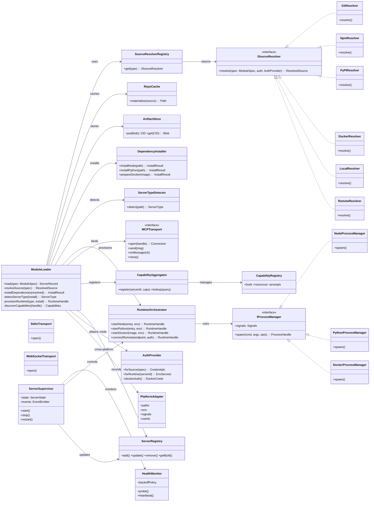
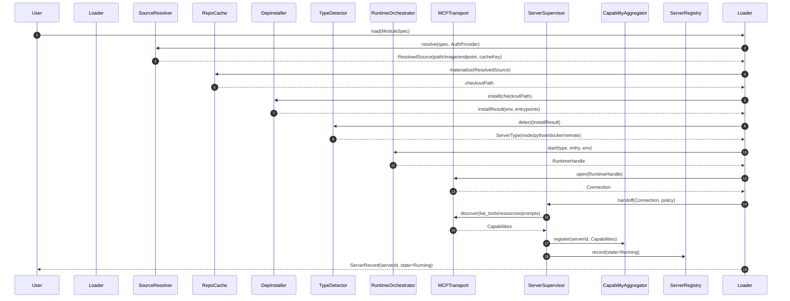
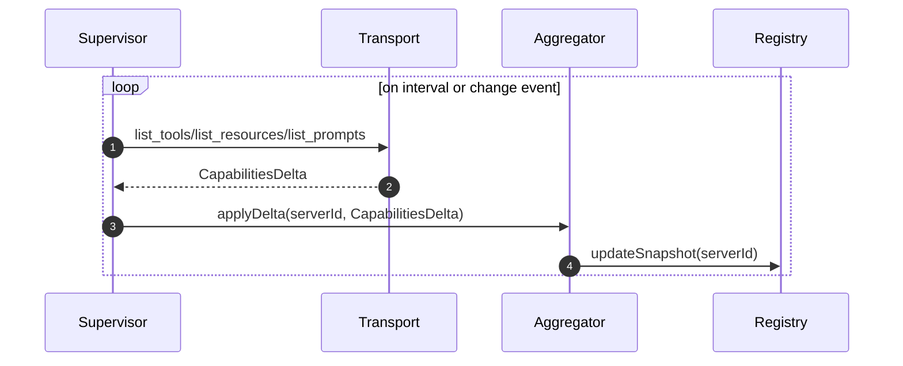
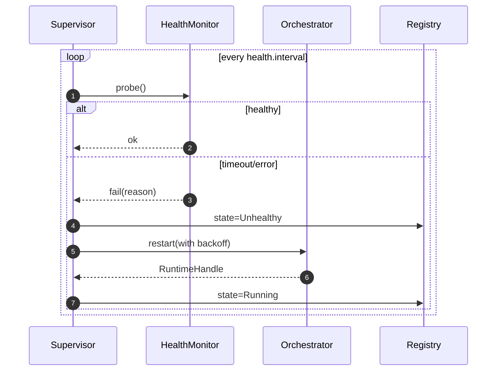

# Master MCP Server — Phase 3 Module Loading Architecture

This document proposes the Phase 3 architecture for the module loading and runtime orchestration layer of the Master MCP Server. It builds on the authentication foundation from Phase 2 and the research findings for Phase 3 to support heterogeneous MCP servers from multiple sources with robust lifecycle management, capability aggregation, and health monitoring.

## Scope and Goals

- Multi-source module loading (git, npm, PyPI, Docker, local; plus remote endpoints/Workers)
- Process management abstraction for local processes (Node.js, Python) and remote runtimes (Workers/HTTP/WebSocket)
- Capability discovery and aggregation across multiple servers with namespacing and conflict resolution
- Server lifecycle management (install, start, stop, restart) with health monitoring and failure recovery
- Cross-platform compatibility (macOS, Linux, Windows) and testable abstractions
- Server type detection and runtime selection
- Repository management and dependency handling with caching and isolation
- Integration with Phase 2 authentication for source access, registry pulls, and server runtime secrets

## Guiding Principles

- Explicit interfaces at every boundary for testability and platform independence
- Deterministic, idempotent installs with content-addressed caching
- Principle of least privilege for credentials and process permissions
- Observability-first: structured logs, health metrics, and lifecycle events
- Fail fast on misconfiguration; auto-recover on transient failures with bounded backoff

---

## Key Abstractions and Interfaces

- `ModuleLoader`: Orchestrates end-to-end load: resolve → fetch → install → detect → run → discover → register
- `SourceResolverRegistry` + `ISourceResolver`: Resolves and fetches modules from different sources
- `RepoCache` and `ArtifactStore`: Content-addressed cache for source artifacts and built assets
- `DependencyInstaller`: Per-language dependency/runtime setup with isolation
- `ServerTypeDetector`: Heuristics/manifests to select runtime (Node/Python/Docker/Remote)
- `RuntimeOrchestrator`: Selects and manages an appropriate `IRuntime` via `IProcessManager` or `IRemoteEndpoint`
- `MCPTransport`: Transport abstraction (stdio, TCP, WebSocket) for MCP protocol
- `CapabilityAggregator` + `CapabilityRegistry`: Aggregated view over tools/resources/prompts, with namespacing
- `ServerSupervisor`: Lifecycle, health monitoring, and failure recovery for each server
- `AuthProvider`: Phase 2 integration for credentials (SCM/registries/runtime secrets)
- `PlatformAdapter`: Cross-platform process, paths, signals, and environment handling
- `ServerRegistry`: Catalog of installed/running servers and their capabilities

---

## Class Diagram



---

## Module Loading (Multi-Source)

Supported source types and resolution rules:

- git: `git+https://host/org/repo[.git]#ref[:subdir]` (token via `AuthProvider`); shallow clone by default; content hash used for cache key
- npm: `npm:package@version` (scoped supported); resolves tarball via registry API; installs under isolated store
- pypi: `pypi:package==version` (wheel or sdist); installs into per-server virtualenv
- docker: `docker:image[:tag@digest]` (pull via registry with optional auth)
- local: `file:/abs/path` or workspace-relative path
- remote: `remote:wss://endpoint` (no fetch/install; direct connect)

Module specification (normalized example):

```json
{
  "id": "my-mcp/faq-bot",
  "source": { "type": "git", "url": "https://github.com/org/repo.git", "ref": "v1.2.3", "subdir": "servers/faq" },
  "runtime": {
    "preferred": ["node", "python", "docker", "remote"],
    "node": { "entry": "bin/server.js", "nodeVersion": ">=18" },
    "python": { "entry": "-m faq_server", "python": ">=3.10" },
    "docker": { "image": "org/faq:1.2.3" },
    "remote": { "endpoint": "wss://mcp.org/faq" }
  },
  "auth": {
    "sourceScopes": ["git:read"],
    "runtimeSecrets": ["FAQ_API_KEY"],
    "registry": ["npm:read"]
  },
  "health": { "probe": "list_tools", "intervalMs": 15000, "restartPolicy": { "maxRestarts": 5, "backoff": "exponential", "baseMs": 500 } },
  "capabilities": { "namespace": "faq", "aliases": { "tools": { "ask": "faq.ask" } } }
}
```

Source resolvers produce a `ResolvedSource` with:

- `cacheKey` (content hash including source URL, ref, lockfiles)
- `path` or `image` or `endpoint`
- `metadata` (license, README, manifest data)

Dependency installation yields an `InstallResult` with isolated path(s), environment variables, and entrypoint resolution.

---

## Process Management Abstraction (Node.js vs Workers)

- Local processes: via `IProcessManager` with consistent spawn/IO/signals across OSes
  - Node: `node entry.js` or `node -e` with resolved entry; supports `stdio` transport
  - Python: `python -m module` with per-server virtualenv activation; `stdio` transport
  - Docker: `docker run --rm ...` with mapped IO; optional TCP/WebSocket transport
- Remote runtimes (Workers/HTTP services): via `IRemoteEndpoint` behind `RuntimeOrchestrator`
  - WebSocket endpoints: `WebSocketTransport`
  - HTTP/TCP bridges: optional adapter translating MCP over web transports

Runtime selection order is configurable (`runtime.preferred`). The `ServerTypeDetector` can override if a manifest explicitly declares a type.

---

## Capability Discovery and Aggregation

- Discovery: After establishing MCP connection, call discovery methods (e.g., `list_tools`, `list_resources`, `list_prompts`) and subscribe to server capability change events if available
- Aggregation: `CapabilityAggregator` writes into a typed `CapabilityRegistry` with:
  - Namespacing: `serverId:toolName` or configured `namespace.tool`
  - Aliases: optional friendly names scoped to a workspace
  - Conflict resolution: policy-based (prefer explicit alias, else fail on collision)
  - Filtering: capabilities gated by access control and feature flags
- Query: unified lookup by name, namespace, type, or tags; supports partial matches and composition

Capability graph encodes dependencies (e.g., tool uses resource) to enable impact analysis and smarter routing.

---

## Server Lifecycle Management

States: `Uninstalled → Installed → Starting → Running → Unhealthy → Stopping → Stopped → Failed`.

- `ServerSupervisor` owns a single server instance lifecycle
  - Start: installs (if needed), provisions runtime, attaches transport, discovers capabilities, registers
  - Stop: drains, sends graceful termination signal, tears down processes, updates registry
  - Restart: policy-driven (on crash, on config change, on health failure), with bounded backoff
  - Update: re-resolve source at new ref/version; blue/green or restart-in-place
- `ServerRegistry` tracks state, PID/handle, capabilities snapshot, metrics, and last errors
- Structured events: `server.started`, `server.capabilities.updated`, `server.crashed`, `server.restarted`, `server.stopped`

---

## Health Monitoring and Failure Recovery

Health strategies (configurable per server):

- Heartbeat: periodic `list_tools` or dedicated `ping` method; timeouts mark Unhealthy
- Process liveness: for local runtimes, process exit/crash detection
- Transport keepalive: WebSocket/TCP ping/pong; reconnect on transient network errors
- Readiness gates: wait for first capability snapshot before declaring Running

Recovery:

- Retry policies: constant/exponential backoff with jitter; `maxRestarts` and `resetWindow`
- Circuit breaker: trip after consecutive failures; require manual intervention or time-based half-open trial
- Quarantine: isolate a repeatedly failing server from aggregator so it does not disrupt routing
- Telemetry hooks: emit counters, timings, and traces for probes and restarts; surface in operator UI/logs

---

## Cross-Platform Compatibility Design

- `PlatformAdapter` encapsulates:
  - Path handling (path separators, quoting, long path support on Windows)
  - Environment and encoding (UTF-8 stdio, locale)
  - Signals and termination semantics (SIGTERM/SIGINT on Unix, CTRL_BREAK on Windows)
  - Shell invocation differences and escaping
  - Proxy settings and CA bundles for outbound network
- No global state: per-server working directories under a managed root, with permissions tightened by platform
- Optional portable Node/Python distributions when host lacks required versions (downloaded once into cache)

---

## Server Type Detection and Runtime Selection

Detection heuristics (highest-confidence wins):

- Manifest: `mcp.json` or `package.json"mcp"` or `pyproject.toml` entry point group `mcp_server`
- Entrypoint presence: Node bin scripts; Python console_scripts or modules
- Dockerfile or image provided; remote endpoint provided
- Language-specific lockfiles: `package-lock.json/pnpm-lock.yaml` (Node), `poetry.lock/requirements.txt` (Python)

Selection rules:

- If manifest declares runtime, honor and verify
- Else prefer configured order and verify entrypoint exists per runtime
- Fallback to remote if local install fails and remote is available (policy-gated)

---

## Repository Management and Dependency Handling

- Isolation per server:
  - Node: install under `.../.stores/node/<cacheKey>` using `npm ci` or `pnpm install --frozen-lockfile`; optionally `--ignore-scripts` with allowlist for safe postinstall
  - Python: create venv under `.../.stores/py/<cacheKey>`; `pip install -r requirements.txt` or `pip install .` with hashes when available
  - Docker: pull by digest; validate image signature when policy requires
- Caching:
  - `RepoCache` materializes sources keyed by content hash (URL+ref+lockfiles)
  - `ArtifactStore` for built assets (e.g., compiled TypeScript) if build is separated
- Reproducibility:
  - Prefer lockfiles; verify engines/python versions; fail with actionable message if mismatch
  - Optional SBOM ingestion to surface license/compliance
- Security:
  - Run installs as non-root; restrict network during build if feasible
  - Validate checksums/digests; enforce minimum provenance for remote artifacts

---

## Authentication Integration (Phase 2)

- `AuthProvider` responsibilities:
  - Source credentials: Git (HTTPS tokens/SSH keys), npm tokens, PyPI API tokens, Docker registry credentials
  - Runtime secrets: environment variables injected into server process or sent as secure MCP initialization params
  - Session tokens for remote endpoints (Workers) with rotation/refresh
- Secret handling:
  - Least privilege, per-server scoping; never write secrets to disk unencrypted
  - Redaction in logs and events; explicit consent required to echo configs containing secrets
- Policy:
  - Capability-level access control in `CapabilityAggregator` (filtering based on user/session scope)

---

## Sequence Diagrams

### Server Loading (Resolve → Run → Discover)



### Capability Discovery and Update



### Health Probe and Auto-Recovery



---

## Runtime/Transport Matrix

- Node: `StdioTransport` over spawned process stdio
- Python: `StdioTransport` over venv-spawned process stdio
- Docker: `StdioTransport` via `docker run` attach; or TCP/WebSocket depending on image
- Remote (Workers): `WebSocketTransport` (preferred) or HTTP bridge

Transports provide a consistent `Connection` event API and backpressure handling.

---

## Configuration and Policies

- Global policy toggles: allow remote fallback, max concurrent servers, per-server CPU/memory limits (where supported)
- Per-server policy: restart strategy, health strategy, capability visibility, aliasing, namespace
- Observability: log levels per component, tracing toggles, metrics sinks

---

## Testability Strategy

- Replaceable interfaces: in-memory `RepoCache`, fake `ISourceResolver`, stub `IProcessManager`, mock `MCPTransport`
- Deterministic tests: fixed clock/backoff; ephemeral temp dirs
- Contract tests for resolvers and runtime managers per platform

---

## Minimal Pseudocode Sketch

```ts
async function load(spec: ModuleSpec): Promise<ServerRecord> {
  const resolver = resolvers.get(spec.source.type)
  const resolved = await resolver.resolve(spec, auth)
  const checkout = await cache.materialize(resolved)
  const install = await deps.install(checkout, spec)
  const runtimeType = await detector.detect(install, spec)
  const handle = await orchestrator.start(runtimeType, install.entry, install.env)
  const conn = await transport.open(handle)
  const supervisor = new ServerSupervisor(handle, conn, spec.health)
  const caps = await supervisor.initialDiscover()
  aggregator.register(spec.id, caps)
  registry.record(spec.id, { state: 'Running', handle, caps })
  supervisor.beginMonitoring()
  return registry.getById(spec.id)
}
```

---

## Scalability Considerations

- Concurrency control: semaphore on installs and startups; per-language worker pools
- Sharding: group servers by runtime type to minimize hot caches; isolate heavy Docker pulls
- Backpressure: limit discovery frequency; delta-based capability updates; lazy load non-critical servers

---

## Summary

This architecture introduces a modular, testable system for loading MCP servers from diverse sources, running them across local and remote runtimes, and composing their capabilities behind a single Master. It integrates with Phase 2 authentication to securely access sources and inject runtime secrets, provides robust lifecycle supervision with health monitoring and recovery, and abstracts platform differences to run consistently on macOS, Linux, and Windows.
```
