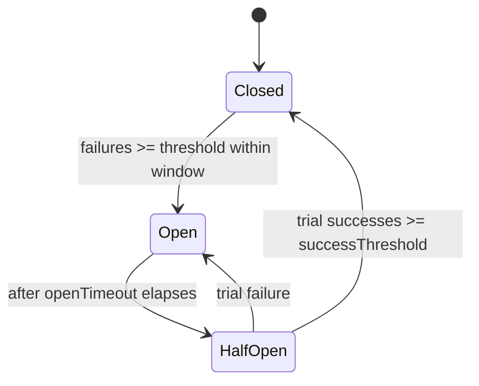
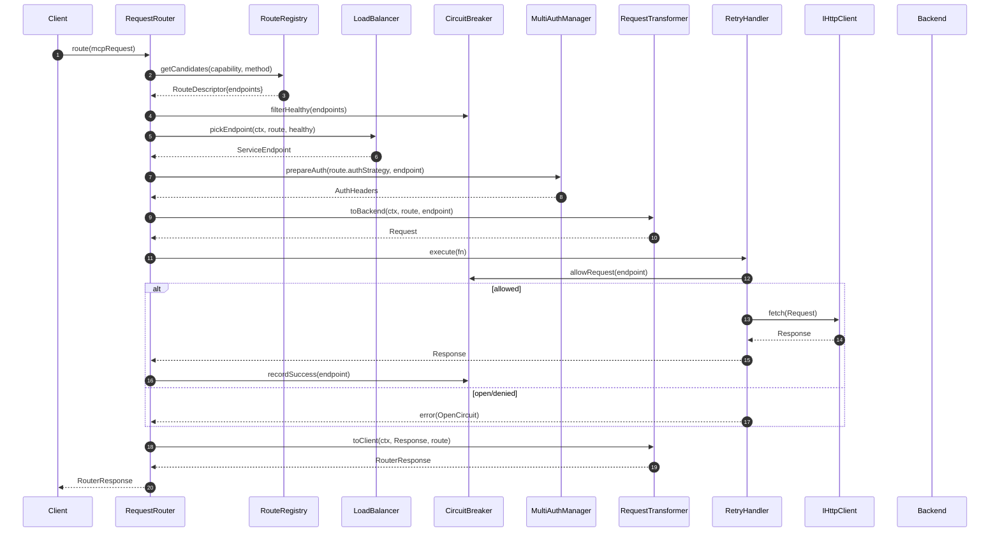

# Master MCP Server — Phase 4 Request Routing System Architecture

This document defines the Phase 4 architecture for the Request Routing System of the Master MCP Server. It builds on Phase 1–3, integrating MultiAuthManager (Phase 2) and CapabilityAggregator (Phase 3) to route MCP protocol requests across multiple backend servers with strong reliability, security, and cross‑platform support (Node.js and Cloudflare Workers).

## Scope and Goals

- Efficient, reliable routing of MCP requests to multiple backend servers
- Dynamic route discovery and updates from CapabilityAggregator
- Pluggable load balancing across healthy instances
- Circuit breaker and health tracking with cross‑platform storage
- Robust retry with exponential backoff and jitter
- Request/response transformation layer for protocol and header shaping
- Full integration with Phase 2 authentication strategies
- Platform‑neutral core: no Node‑specific APIs in core routing logic

Non‑goals:

- Implementing a specific backend server; this focuses on the router and its contracts
- Building a full observability stack; we define hooks and metrics, not vendor wiring

---

## Guiding Principles

- Clear interfaces and dependency inversion for testability and portability
- Fail fast, retry smart: bounded backoff, circuit breaking, health‑aware balancing
- Security by default: strict header hygiene, allowlists, scoped credentials
- Streaming first: preserve backpressure and incremental delivery
- Observability: structured events, standardized metrics, trace context propagation

---

## High‑Level Architecture

```mermaid
flowchart LR
  Client[Client / MCP Frontend] -->|MCP JSON-RPC| RR(RequestRouter)
  subgraph Router[Routing Pipeline]
    RR --> REG[RouteRegistry]
    RR --> LB[LoadBalancer]
    RR --> CB[CircuitBreaker]
    RR --> RT[RequestTransformer]
    RR --> RH[RetryHandler]
    RR --> AM[MultiAuthManager]
    RR --> HC[IHttpClient]
  end
  REG <-->|capabilities, routes| CA[CapabilityAggregator]
  CB --> ST[ICircuitStateStore]
  HC -->|HTTP(S)| BE1[(Backend A)]
  HC -->|HTTP(S)| BE2[(Backend B)]
```

Pipeline overview:

1) Resolve candidates from `RouteRegistry` (fed by `CapabilityAggregator` + static config)
2) Choose an endpoint with `LoadBalancer` filtered by circuit/health status
3) Prepare auth via `MultiAuthManager` using the route’s `authStrategy`
4) Transform request for backend (`RequestTransformer.toBackend`)
5) Execute with `RetryHandler` while consulting `CircuitBreaker`
6) Transform response to client (`RequestTransformer.toClient`), record success/failure, emit metrics

---

## Core Components

### Enhanced RequestRouter

Responsibilities:
- Orchestrate the end‑to‑end routing pipeline per request
- Maintain per‑request context: capability, auth, correlation/trace IDs, idempotency
- Integrate with `RouteRegistry`, `LoadBalancer`, `CircuitBreaker`, `RetryHandler`, `RequestTransformer`, and `MultiAuthManager`
- Cross‑platform execution using `fetch`‑compatible `IHttpClient`

Key behaviors:
- Strict timeouts and cancellation support
- Streaming passthrough for request/response bodies
- Header sanitation and X‑Forwarded/Via handling
- Outcome classification (success, retriable, non‑retriable) for breaker and metrics

### RouteRegistry (new)

Responsibilities:
- Maintain dynamic mapping from capability/method → route candidates
- Merge static configuration and live updates from `CapabilityAggregator`
- Expose healthy candidates filtered by current circuit states

Data model (simplified):
```ts
export type AuthStrategy = 'master_oauth' | 'delegate_oauth' | 'proxy_oauth' | 'bypass_auth'

export interface ServiceEndpoint {
  id: string
  baseUrl: string // https://host[:port]/path
  tags?: string[] // e.g., ["primary","eu","canary"]
}

export interface RouteDescriptor {
  id: string
  capability: string // e.g., "tools.search", "resources.read"
  method: string // MCP method name
  endpoints: ServiceEndpoint[]
  authStrategy: AuthStrategy
  timeoutMs?: number
  retry?: RetryPolicy
  breaker?: CircuitBreakerPolicy
  lb?: LoadBalancingPolicy
  transform?: TransformPolicy
  security?: SecurityPolicy
}
```

APIs:
```ts
export interface RouteRegistry {
  getCandidates(capability: string, method: string): RouteDescriptor | undefined
  listRoutes(): RouteDescriptor[]
  upsertRoute(route: RouteDescriptor): void
  removeRoute(routeId: string): void
  refreshFromAggregator(snapshot: AggregatedCapabilities): void
  subscribe(cb: (evt: RouteRegistryEvent) => void): () => void
}
```

### CircuitBreaker (new)

Responsibilities:
- Track per‑endpoint failure/success rates and trip/open/half‑open states
- Gate requests (“allow/deny trial”) and record outcomes
- Persist state in a pluggable store compatible with Node and Workers

State machine:


Policies and storage:
```ts
export interface CircuitBreakerPolicy {
  failureThreshold: number // consecutive or error rate with window
  windowMs: number
  openTimeoutMs: number // time before half-open
  halfOpenMaxInFlight: number // limit concurrent trials
  successThreshold: number // trials to close
  trackBy?: 'endpoint' | 'route' | 'capability' // granularity
}

export type CircuitState = 'closed' | 'open' | 'half_open'

export interface CircuitKey { scope: string; id: string } // e.g., {scope:'endpoint', id:'backendA'}

export interface CircuitSnapshot {
  key: CircuitKey
  state: CircuitState
  counts: { failures: number; successes: number }
  openedAt?: number; halfOpenedAt?: number
}

export interface ICircuitStateStore {
  get(key: CircuitKey): Promise<CircuitSnapshot | undefined>
  put(snap: CircuitSnapshot): Promise<void>
  update(key: CircuitKey, fn: (cur?: CircuitSnapshot) => CircuitSnapshot): Promise<CircuitSnapshot>
  now(): number // logical clock for tests
}
```

Built‑in stores:
- InMemoryCircuitStore (default, Node/Workers)
- RedisCircuitStore (Node adapter)
- WorkersKVStore or DurableObjectCircuitStore (Workers adapter)

### LoadBalancer (new)

Responsibilities:
- Choose a target endpoint among candidates using strategy and health signals
- Support sticky routing by key (e.g., session, tool/resource name)

Strategies:
- round_robin, weighted_rr, least_errors, least_latency, power_of_two_choices, sticky_by_key

API:
```ts
export interface LoadBalancingPolicy {
  strategy: 'round_robin' | 'weighted_rr' | 'least_latency' | 'least_errors' | 'p2c' | 'sticky_by_key'
  weights?: Record<string, number> // endpointId -> weight
  stickyKey?: (ctx: RouterRequestContext) => string | undefined
}

export interface LoadBalancer {
  pickEndpoint(ctx: RouterRequestContext, route: RouteDescriptor, healthy: ServiceEndpoint[]): ServiceEndpoint
  observeResult(endpointId: string, outcome: 'success' | 'error', latencyMs: number): void
}
```

### RequestTransformer (new)

Responsibilities:
- Map client MCP request/headers to backend HTTP request
- Normalize paths, inject query/headers, remove hop‑by‑hop headers
- Translate backend responses back to MCP response types

API and config:
```ts
export interface TransformPolicy {
  path?: { prefix?: string; rewrite?: (original: string, ctx: RouterRequestContext) => string }
  headers?: {
    add?: Record<string, string | ((ctx: RouterRequestContext) => string | undefined)>
    remove?: string[] // e.g., Connection, Proxy-Authentication, etc.
    preserve?: string[] // explicit allowlist
  }
  query?: Record<string, string | ((ctx: RouterRequestContext) => string | undefined)>
  body?: {
    toBackend?: (body: unknown, ctx: RouterRequestContext) => BodyInit | ReadableStream | null
    toClient?: (resp: Response, ctx: RouterRequestContext) => Promise<unknown>
  }
}

export interface RequestTransformer {
  toBackend(ctx: RouterRequestContext, route: RouteDescriptor, ep: ServiceEndpoint): Promise<Request>
  toClient(ctx: RouterRequestContext, backendResp: Response, route: RouteDescriptor): Promise<RouterResponse>
}
```

Note: The default transformer forwards JSON bodies with streaming support and strips hop‑by‑hop headers: `Connection, Keep-Alive, Proxy-Authenticate, Proxy-Authorization, TE, Trailer, Transfer-Encoding, Upgrade`. It appends `X-Forwarded-For`, `X-Forwarded-Proto`, `X-Forwarded-Host`, and `Via`.

### RetryHandler (new)

Responsibilities:
- Execute backend calls with bounded retries and exponential backoff
- Respect idempotency and error classification; integrate with circuit breaker

Policy and API:
```ts
export interface RetryPolicy {
  maxAttempts: number // including first attempt
  baseDelayMs: number
  maxDelayMs: number
  jitter: 'full' | 'equal' | 'decorrelated'
  retryOn: (result: { status?: number; error?: unknown }) => boolean
  idempotentMethods?: string[] // e.g., ["tools.get", "resources.read"]
}

export interface RetryHandler {
  execute<T>(ctx: RouterRequestContext, fn: () => Promise<T>): Promise<T>
}
```

### IHttpClient (cross‑platform)

Abstraction over `fetch` for Node and Workers; provides request timeouts, aborts, streaming, and metrics hooks.

```ts
export interface IHttpClient {
  fetch(input: Request | string, init?: RequestInit & { timeoutMs?: number; signal?: AbortSignal }): Promise<Response>
}
```

Implementations:
- Workers: native `fetch`
- Node: global `fetch` (Node >=18); optionally adapter on top of undici (outside core)

---

## Request Routing Pipeline



Failure path with fallback:
- If `OpenCircuit` or retriable 5xx/timeout, RR asks LB for an alternate healthy endpoint and retries within policy bounds.

---

## Authentication Integration (Phase 2)

The router integrates with `MultiAuthManager` to support four strategies per route:

- master_oauth: Use the server’s master OAuth client to mint/access tokens; inject `Authorization: Bearer <token>`
- delegate_oauth: Use a delegated provider bound to the backend (e.g., per‑tenant or per‑service client)
- proxy_oauth: Forward the caller’s token or exchange it (subject to policy and scope checks)
- bypass_auth: No credentials injected (only safe for public or mTLS‑protected backends)

Router contract:
```ts
type AuthResult = { headers?: Record<string, string>; tokenInfo?: unknown }

interface MultiAuthManager {
  prepare(route: RouteDescriptor, endpoint: ServiceEndpoint, ctx: RouterRequestContext): Promise<AuthResult>
}
```

The router attaches returned headers and ensures tokens are never logged, stored in responses, or leaked through error paths. Token caching and refresh are handled by `MultiAuthManager`.

---

## Capability Aggregator Integration (Phase 3)

- `CapabilityAggregator` exposes a merged view of tools/resources/prompts with origin server metadata
- `RouteRegistry` subscribes to capability change events and resolves them into `RouteDescriptor`s
- Conflicts (same capability from multiple servers) are resolved by policy: priority, weights, tags, or explicit mapping
- Registry updates are atomic; versioned snapshots permit lock‑free reads by the router

---

## Error Handling and Fallbacks

Error classes:
- Client errors (4xx except 408/429): do not retry; propagate
- Retriable server/network: 408, 429 (respect `Retry-After`), 500, 502, 503, 504, connection reset/timeout
- Non‑retriable server: 501, 505, protocol/transform errors

Fallback order:
1) Retry same endpoint if transient and policy allows
2) Alternate healthy endpoint via `LoadBalancer`
3) Degrade: alternate route/capability alias (optional, opt‑in)
4) Fail with structured MCP error including correlation ID and sanitized root cause

All outcomes update the breaker and LB observations. Backoff uses jitter (default: full‑jitter) to prevent thundering herds.

---

## Security Considerations

- Header sanitation: remove hop‑by‑hop and untrusted proxy headers; re‑write `Host`
- Domain allowlists: endpoints must match configured allowed hosts/prefixes to prevent SSRF
- TLS: enforce HTTPS by default; custom CA bundles via platform adapter; mTLS optional (adapter‑specific)
- Scope isolation: auth strategies scoped per route; never cross‑leak tokens between tenants/routes
- Request size/time limits: configurable max body size and per‑route timeout; protect against slow‑loris
- Input validation: validate capability/method names and transformation outputs
- Sensitive data redaction in logs and errors
- Optional request signing between router and trusted backends

---

## Performance and Scaling

- Zero‑copy streaming of bodies; preserve backpressure
- Keep‑alive and HTTP/2 where platform allows (via `fetch` runtime)
- Token and capability snapshot caching with TTLs
- Concurrency control per route; queue or shed excess load with 429
- Load metrics feedback into `least_latency`/`least_errors` strategies
- Horizontal scale: stateless router instances share breaker state via pluggable store (Redis, KV)
- Cold‑start mitigation on Workers: lazy init with warmed snapshots

---

## Cross‑Platform Compatibility

- Core uses Web Standard APIs: `fetch`, `Request`, `Response`, `AbortController`, `ReadableStream`
- Platform adapters provide:
  - `IHttpClient` (Node: global fetch/undici; Workers: native fetch)
  - `ICircuitStateStore` (Node: memory/Redis; Workers: KV/Durable Object)
  - Clock/timer abstractions for deterministic tests
- No Node‑only modules in core (no `net`, `http`, `tls`); adapters encapsulate platform specifics

---

## Configuration Patterns

Example (TypeScript/JSON‑like):
```ts
export const routingConfig = {
  security: {
    allowedHosts: ["api.service.local", "*.trusted.example.com"],
    stripHeaders: ["connection","proxy-authorization","transfer-encoding","upgrade","te","keep-alive","trailer"],
  },
  defaults: {
    timeoutMs: 15000,
    retry: { maxAttempts: 3, baseDelayMs: 200, maxDelayMs: 2000, jitter: 'full' },
    breaker: { failureThreshold: 5, windowMs: 10000, openTimeoutMs: 15000, halfOpenMaxInFlight: 1, successThreshold: 2, trackBy: 'endpoint' },
    lb: { strategy: 'p2c' },
  },
  routes: [
    {
      id: 'search-tools',
      capability: 'tools.search',
      method: 'tools.search',
      authStrategy: 'delegate_oauth',
      endpoints: [
        { id: 'search-a', baseUrl: 'https://search-a.trusted.example.com' },
        { id: 'search-b', baseUrl: 'https://search-b.trusted.example.com' },
      ],
      lb: { strategy: 'least_latency' },
      retry: { maxAttempts: 4, baseDelayMs: 100, maxDelayMs: 1500, jitter: 'full', retryOn: ({status}) => !status || [408,429,500,502,503,504].includes(status) },
      transform: {
        path: { prefix: '/mcp' },
        headers: { preserve: ['content-type'], remove: ['cookie'] },
      },
      security: { allowQueryParams: ['q','limit'] }
    }
  ]
}
```

Dynamic updates:
- `RouteRegistry.refreshFromAggregator(snapshot)` rebuilds route mappings based on capability origins and advertised endpoints
- Static config provides defaults; aggregator may override endpoints and weights at runtime

---

## Interfaces and Contracts (TypeScript)

```ts
export interface RouterRequestContext {
  id: string // correlation id
  capability: string
  method: string
  mcpRequest: unknown // JSON-RPC 2.0 payload
  headers: Record<string,string>
  body?: unknown | ReadableStream
  deadlineMs?: number
  platform: 'node' | 'worker'
  trace?: { traceId?: string; spanId?: string; parentId?: string }
}

export interface RouterResponse {
  status: number
  headers: Record<string,string>
  body: unknown | ReadableStream
}

export interface RequestRouter {
  route(ctx: RouterRequestContext): Promise<RouterResponse>
}
```

Observability hooks:
```ts
interface RouterEvents {
  onRouteSelected(data: { routeId: string; endpointId: string }): void
  onRetry(data: { attempt: number; delayMs: number; reason: string }): void
  onBreakerState(data: { key: CircuitKey; state: CircuitState }): void
  onBackendTiming(data: { endpointId: string; latencyMs: number; status?: number }): void
  onError(err: Error & { code?: string; cause?: unknown }): void
}
```

---

## Pseudocode Sketch (Router)

```ts
async function route(ctx: RouterRequestContext): Promise<RouterResponse> {
  const route = registry.getCandidates(ctx.capability, ctx.method)
  if (!route) throw new Error(`No route for ${ctx.capability}:${ctx.method}`)

  const healthy = await filterHealthy(route.endpoints)
  if (healthy.length === 0) throw new Error('No healthy backends')

  const attempt = async (): Promise<Response> => {
    const endpoint = lb.pickEndpoint(ctx, route, healthy)
    events.onRouteSelected({ routeId: route.id, endpointId: endpoint.id })

    // Auth
    const auth = await authManager.prepare(route, endpoint, ctx)

    // Transform
    const backendReq = await transformer.toBackend(ctx, route, endpoint)
    for (const [k,v] of Object.entries(auth.headers ?? {})) backendReq.headers.set(k, v)

    // Breaker gate
    const allowed = await breaker.allow(endpoint.id)
    if (!allowed) throw new OpenCircuitError(endpoint.id)

    const start = now()
    try {
      const resp = await http.fetch(backendReq, { timeoutMs: route.timeoutMs ?? defaults.timeoutMs })
      const latency = now() - start
      lb.observeResult(endpoint.id, resp.ok ? 'success' : 'error', latency)
      await breaker.record(endpoint.id, resp.ok)
      return resp
    } catch (e) {
      const latency = now() - start
      lb.observeResult(endpoint.id, 'error', latency)
      await breaker.record(endpoint.id, false)
      throw e
    }
  }

  const resp = await retryHandler.execute(ctx, attempt)
  return transformer.toClient(ctx, resp, route)
}
```

---

## Reliability and Health Management

- Passive health: infer from successes/failures, timeouts, status codes
- Active health (optional): periodic HEAD/GET to `/.health` or MCP ping, updating breaker counts out‑of‑band
- Quarantine: sustained failures trip breaker to open; registry omits quarantined endpoints from selection
- Half‑open trial: limited in‑flight probes to avoid stampedes

---

## Observability

- Metrics (dim: routeId, endpointId, method, outcome):
  - request.count, request.latency.ms, retry.count, breaker.state, backend.status_code
- Logs: structured events with correlation IDs, no secrets
- Tracing: propagate W3C Trace‑Context headers to backends; create spans around backend calls

---

## Testing Strategy

- Unit tests with in‑memory adapters for LB, breaker, registry, and http client
- Deterministic backoff using fake timers and injected clock
- Contract tests for auth strategies and header sanitation
- Cross‑platform tests: Node runtime and Miniflare/Workers runtime for parity

---

## File/Module Layout (proposed)

- `src/modules/request-router.ts` (enhanced RequestRouter orchestrator)
- `src/routing/route-registry.ts` (RouteRegistry + static/dynamic sources)
- `src/routing/circuit-breaker.ts` (+ stores: in‑memory, redis, workers‑kv)
- `src/routing/load-balancer.ts` (strategies and telemetry feedback)
- `src/routing/request-transformer.ts` (default transformer + per‑route hooks)
- `src/routing/retry-handler.ts` (policies and jitter backoff)
- `src/platform/http-client.ts` (IHttpClient adapters)
- `src/platform/stores/*` (Redis, KV, Durable Object adapters)

---

## Migration Notes (from Phase 3)

- Replace basic RequestRouter with orchestrated pipeline and typed interfaces
- Wire `RouteRegistry` to `CapabilityAggregator` events for live route updates
- Integrate auth via `MultiAuthManager.prepare` in the transformer phase
- Introduce default policies and allow per‑route overrides via config

---

## Open Questions / Future Enhancements

- Sticky routing policies across sessions/users; persistence and privacy implications
- Per‑tenant QoS and rate limiting integrated with router context
- Request signing/mTLS between router and backends
- Adaptive concurrency limits based on observed latency/error budgets

---

## Summary

This Phase 4 architecture delivers a robust, testable, and portable routing system. It composes well‑defined components—RouteRegistry, LoadBalancer, CircuitBreaker, RequestTransformer, RetryHandler—around an enhanced RequestRouter, integrates with Phase 2 authentication and Phase 3 capability discovery, and maintains cross‑platform compatibility. The design prioritizes security, observability, and performance to support production workloads at scale.
