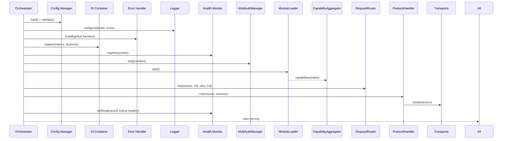
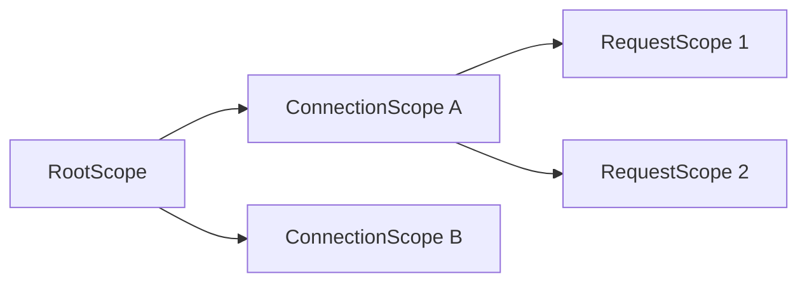
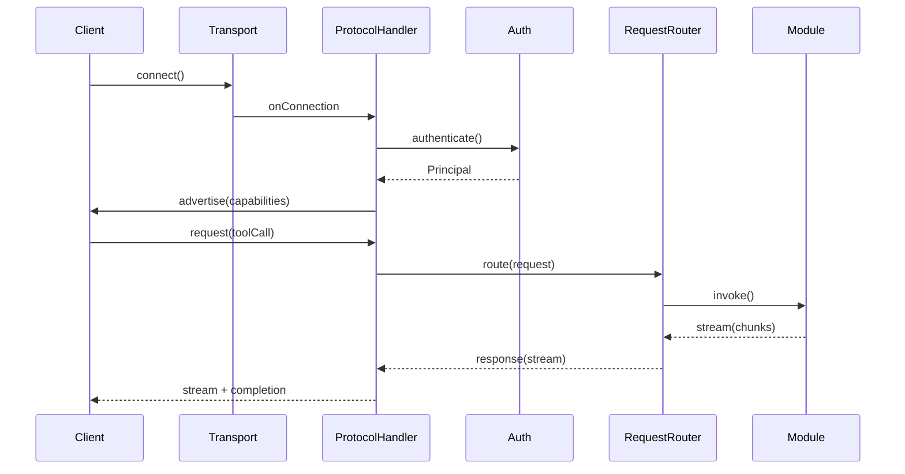
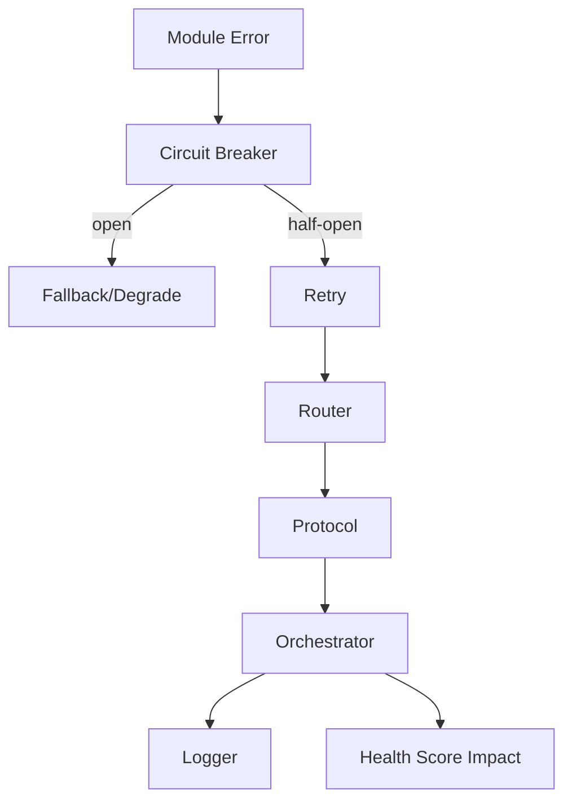
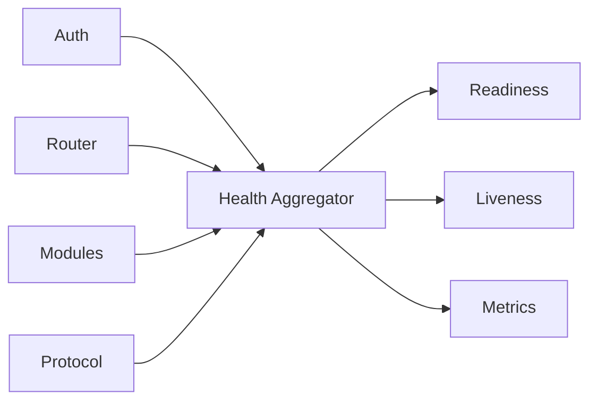
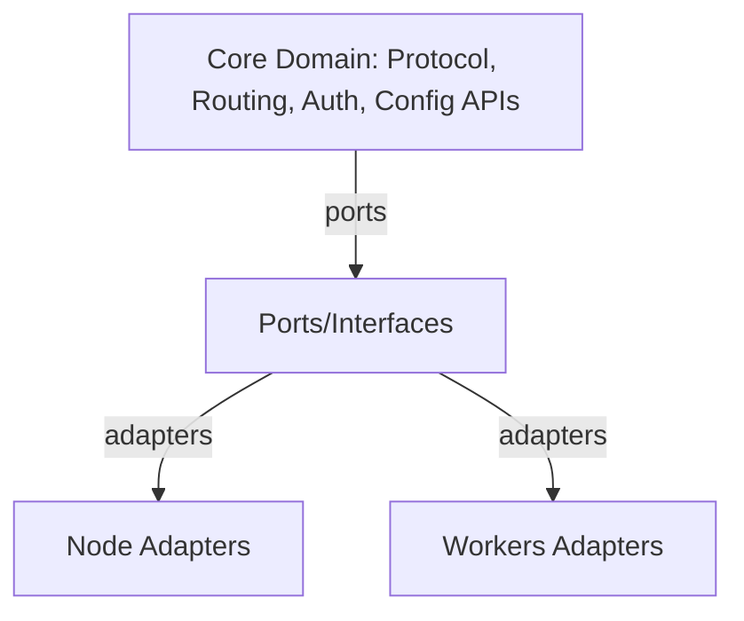
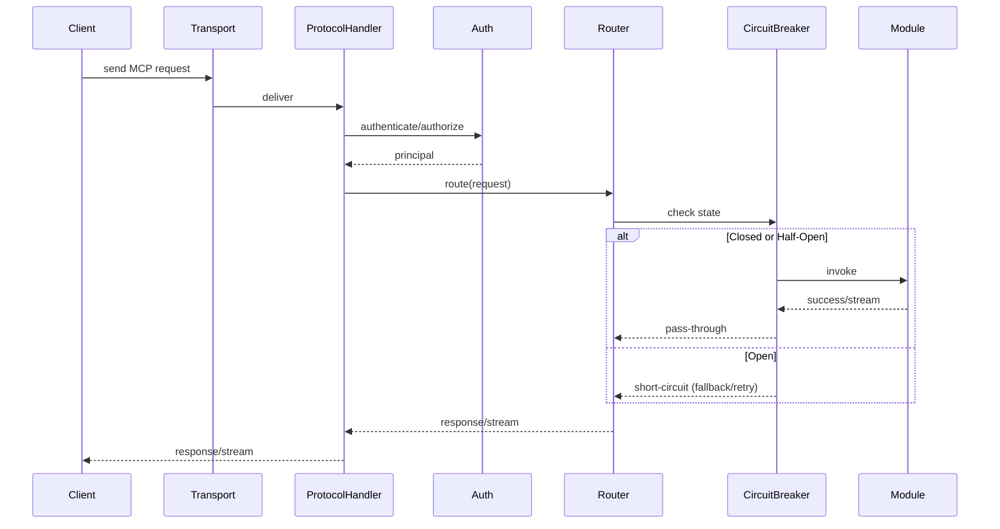

# Phase 5: Core Master Server Architecture

This document defines the production-grade architecture for the Master MCP Server, integrating Phases 1–4 into a cohesive, reliable, and cross‑platform system that fully implements the Model Context Protocol (MCP) with high performance and strong operational characteristics.

## Goals and Non-Functional Requirements
- Reliability: graceful degradation, fault isolation, circuit breakers, retries.
- Performance: low-latency routing, streaming, backpressure, batching where helpful.
- Cross-platform: single codebase targeting Node.js and Cloudflare Workers.
- Observability: structured logs, metrics, health probes, trace context propagation.
- Security: unified authentication/authorization, least privilege, secret hygiene.
- Operability: clear lifecycle, config hot-reload (Node), safe rollouts, predictable shutdown.

---

## High-Level Architecture

Core integration components introduced or finalized in Phase 5:
- Enhanced ProtocolHandler: complete MCP semantics (handshake, capabilities, requests, streaming, events, cancellation, errors).
- Master Server Orchestrator: central lifecycle and coordination (start, run, stop, drain).
- Configuration Manager: layered config loading, schema validation, subscription, and safe reload.
- Dependency Container: DI with lifetimes (singleton, scoped, transient) and per-connection scope.
- Health Monitor: status aggregation, readiness/liveness probes, component scorecards.
- Error Handler: typed errors, global boundaries, recovery, and escalation policies.

Previously delivered components integrated here:
- MultiAuthManager + OAuth providers (Phase 2).
- ModuleLoader, CapabilityAggregator, RequestRouter (Phase 3).
- Routing resilience: circuit breakers, retry, load balancing (Phase 4).

### Component View
```mermaid
flowchart TD
  subgraph Orchestrator[Master Server Orchestrator]
    DIR[Dependency Container]
    CFG[Configuration Manager]
    ERR[Error Handler]
    HLTH[Health Monitor]
    LOG[Structured Logger]
  end

  subgraph Protocol[Enhanced ProtocolHandler]
    TRANS[Transport Adapters\n(HTTP/WebSocket/Stdio)]
    SESS[Session Manager]
    CANC[Cancellation & Backpressure]
  end

  subgraph Routing[Request Routing Plane]
    AUTH[MultiAuthManager]
    CAP[CapabilityAggregator]
    RTR[RequestRouter\n+ CircuitBreakers/Retry/LB]
  end

  subgraph Modules[Module Layer]
    MODS[(Loaded Modules)]
  end

  Orchestrator -->|wires| Protocol
  Orchestrator -->|wires| Routing
  Orchestrator -->|wires| Modules

  Protocol --> AUTH
  Protocol --> RTR
  RTR --> CAP
  CAP --> MODS

  CFG --> Orchestrator
  CFG --> Protocol
  CFG --> Routing
  CFG --> Modules

  ERR --> Orchestrator
  ERR --> Protocol
  ERR --> Routing
  ERR --> Modules

  HLTH --> Orchestrator
  HLTH --> Protocol
  HLTH --> Routing
  HLTH --> Modules

  LOG --> Orchestrator
  LOG --> Protocol
  LOG --> Routing
  LOG --> Modules
```

---

## Key Architectural Decisions

- Main Server Structure: a single `MasterServer` orchestrator composes a DI container and wires all subsystems; per-connection scopes are created for protocol sessions.
- Communication Style: direct method calls within a process; event bus for health/events. No cross-process RPC assumed in baseline; can later extend via adapters.
- Dependency Injection: DI container with typed tokens; limited service locator only within the orchestrator/bootstrap to resolve dynamic plugins.
- Configuration Strategy: layered cascade (defaults → file(s) → env → secrets → CLI → runtime overrides) with schema validation and subscription for safe reload.
- Error Handling: hierarchical boundaries (transport → protocol → routing → module); typed errors with recovery policies and circuit breakers.
- Health Model: readiness gated on minimal critical set; liveness permissive; component-level health scores aggregated for roll-up status.
- Cross-Platform: hexagonal architecture with platform adapters for transport, storage, timers, crypto, and process signals.

---

## Initialization and Lifecycle

### Phased Startup Sequence
1. Load Config: read layered config, validate schema, materialize effective config.
2. Init Logger: configure structured logger (sinks, levels, redaction) early.
3. Init Error Handler: install global handlers (unhandledRejection, uncaughtException or equivalent), attach context enrichers.
4. Build DI Container: register tokens, factories, lifetimes; inject config/logger/error handler.
5. Init Health Monitor: register component health probes, start periodic sampling.
6. Init Auth Providers: instantiate `MultiAuthManager` with configured providers, test credentials (non-destructive capability check).
7. Load Modules: `ModuleLoader` discovers/loads modules; `CapabilityAggregator` indexes capabilities.
8. Build Routing Plane: instantiate `RequestRouter` with policy bundle (circuit breakers, retry, load balancing strategy, budgets).
9. Init ProtocolHandler: bind transports; configure session manager, streaming, cancellation, backpressure.
10. Expose Probes: bind readiness/liveness endpoints and metrics (if platform permits).
11. Accept Traffic: mark readiness when critical set is healthy (Auth, Modules minimal set, Router, Protocol), begin serving.



### Runtime and Shutdown
- Runtime: Orchestrator supervises components; health changes emit events; config updates trigger safe reload paths.
- Graceful Shutdown: stop accepting new connections, drain in-flight with deadline, unload modules, release resources (timers, caches, connections) via DI disposers.


---

## Configuration Management

### Cascade and Overrides
- Sources (precedence low→high): defaults → config file(s) → environment → secrets store → CLI flags → runtime overrides (admin API / KV).
- Validation: TypeScript-first schema (e.g., Zod or TypeBox) to produce typed `EffectiveConfig`.
- Distribution: DI injects `ConfigAccessor` into components; subscriptions for on-change with guarded apply.
- Hot Reload (Node): file watcher with debounce; validate then atomically swap; rollback on failure.
- Controlled Reload (Workers): pull from KV/Durable Object on interval/trigger; ETag to avoid redundant work.

```mermaid
flowchart TB
  Def[Defaults] --> Merge
  File[Config File(s)] --> Merge
  Env[Environment Vars] --> Merge
  Sec[Secrets Provider] --> Merge
  CLI[CLI Flags] --> Merge
  RT[Runtime Overrides] --> Merge
  Merge -->|validate| Eff[EffectiveConfig]
  Eff --> DI
  Eff --> Sub[Subscribers]
```

### Config Scoping
- Global: server-level parameters (ports, timeouts, logging, metrics, transports).
- Auth: providers, token lifetimes, audience, JWKS, scopes.
- Routing: retry policies, breaker thresholds, budgets, load balancing strategy.
- Modules: per-module config blocks with namespaced keys.
- Platform: adapter knobs (Workers vs Node-specific limits).

### Example (illustrative)
```ts
interface EffectiveConfig {
  server: { maxConcurrent: number; idleTimeoutMs: number; },
  logging: { level: 'debug'|'info'|'warn'|'error'; redaction: string[] },
  transports: { http?: { port: number }, ws?: { port: number }, stdio?: { enabled: boolean } },
  auth: { providers: ProviderConfig[]; audience?: string },
  routing: { retry: RetryPolicy; breaker: BreakerPolicy; lb: 'round_robin'|'least_latency'|'hashed' },
  modules: Record<string, unknown>,
  platform: { runtime: 'node'|'workers'; limits?: { memoryMb?: number } },
}
```

---

## Dependency Container

- Tokens: string/symbol keys for services (`TOKENS.Logger`, `TOKENS.Config`, etc.).
- Lifetimes: singleton (process), scoped (per connection/request), transient (per resolve).
- Scopes: `RootScope` built at startup; `ConnectionScope` created by ProtocolHandler for each session; `RequestScope` optional for per-request overrides.
- Disposal: async disposers executed on scope teardown (close connections, timers, streams).

```ts
// Conceptual DI usage
container.register(TOKENS.Config, { useValue: effectiveConfig });
container.register(TOKENS.Logger, { useFactory: () => createLogger(effectiveConfig) });
container.register(TOKENS.Router, { useFactory: (c) => new RequestRouter(c.get(TOKENS.Policies)) });
// Per-connection scope
const scope = container.createScope('connection');
scope.register(TOKENS.SessionContext, { useValue: sessionCtx });
```



---

## Enhanced ProtocolHandler (MCP)

Responsibilities:
- Implements full MCP handshake and capability advertisement using `CapabilityAggregator`.
- Manages sessions: authentication, context, and resource cleanup per connection.
- Streams: supports chunked responses, tool outputs, and progress events.
- Cancellation: `AbortController` per request with propagation to modules.
- Backpressure: limits concurrent in-flight per session and globally; applies queuing policies.
- Errors: maps internal typed errors to MCP-compliant error responses with redaction of sensitive details.



---

## Routing Plane Integration

- CapabilityAggregator: collects and normalizes capability metadata (names, schemas, costs, latencies) used for routing decisions and capability advertisement.
- RequestRouter: chooses target module(s) with policies:
  - Circuit breakers per module and per-capability (Phase 4).
  - Retries with jitter and idempotency guard.
  - Load balancing strategies selectable by config (RR/latency/hashed).
- Observability: propagates tracing, emits structured events on route selection, retry, and fallback.

---

## Error Handling and Recovery

### Error Taxonomy
- Auth errors: unauthenticated/unauthorized.
- Protocol errors: invalid message, timeout, cancel, stream mismatch.
- Routing errors: no route, overloaded, exhausted budgets.
- Module errors: tool failures, validation errors, transient infra errors.
- System errors: resource exhaustion, internal bug.

### Propagation and Boundaries


### Recovery Strategies
- Resiliency: circuit breakers, exponential backoff with jitter, hedged requests for read-only ops (optional), deadline propagation.
- Degradation: fallback modules/capabilities; reduce concurrency; temporarily hide a capability from advertisement when health is poor.
- Containment: per-session and per-module quotas; memory and time budgets.
- Escalation: error budgets breach triggers health status downgrade and alert event.

### Global Error Handling
- Install top-level handlers; tag errors with request/session ids; redact secrets.
- Provide configurable policy: crash-on-unknown vs isolate-and-continue.

---

## Health Monitoring and Status

- Probes: each component exposes `getStatus(): { level: ok|warn|error, details, since }`.
- Aggregation: Health Monitor rolls up to liveness/readiness:
  - Liveness: process is running; always `ok` unless unrecoverable runtime.
  - Readiness: critical dependencies healthy; traffic accepted only when `ok`.
- Endpoints: `/health/live`, `/health/ready` (Node HTTP/WS server); Workers implement via `fetch` route.
- Metrics: counters, gauges, histograms (requests, latencies, errors, CB state, queue depth).



---

## Resource Management

- Memory: bounded caches; object pools; streaming to avoid buffering; truncate logs.
- Concurrency: global and per-session max in-flight; fair queueing; backpressure signals to clients.
- Connections: idle timeouts; keep-alive tuning; graceful draining.
- Cleanup: DI disposers ensure transports, timers, and streams are closed on scope teardown.

---

## Performance and Scalability

- Fast path: avoid deep object cloning; zero-copy streaming; minimize JSON transforms.
- Adaptive concurrency: adjust per-module limits based on observed latency/error rate.
- Load balancing: choose strategy by workload; record EWMA latencies for least-latency mode.
- Batching: optional batching of compatible small requests (configurable) at router ingress.
- Pre-warming: module cold-start mitigation; background prime caches after startup.
- Parallelism:
  - Node: optional worker threads/process clustering guarded by shared-nothing design.
  - Workers: shard by tenant/key using Durable Objects or consistent hashing to DO ids.
- Observability: percentile latencies (p50/p95/p99), error rates, breaker state, queue depth, GC pauses.
- SLOs (illustrative):
  - Ready under 3s cold start (Node), 500ms warm start (Workers).
  - p95 routing overhead < 5ms (excludes module execution).
  - Error budget 0.1% for routing plane.

---

## Cross-Platform Compatibility

### Hexagonal Boundaries
- TransportAdapter: `stdio` (Node), `ws/http` (Node/Workers), optional `unix/tcp` (Node-only).
- StorageAdapter: filesystem (Node) vs KV/DO (Workers).
- TimerAdapter: `setTimeout` (Node) vs Alarms/Scheduled (Workers-safe patterns).
- CryptoAdapter: Node `crypto` vs WebCrypto API.
- ProcessSignals: Node signals vs Workers’ abort signals and controller semantics.



### Platform Notes
- Node.js
  - Can expose HTTP/WS servers and stdio; supports file watchers; native TCP.
  - Graceful shutdown via SIGINT/SIGTERM; use `server.close()` + connection tracking.
  - Prefer `pino` for JSON logs, `undici` for HTTP.
- Cloudflare Workers
  - No TCP/stdio; use `fetch` and `WebSocketPair`; state via KV/Durable Objects.
  - No long synchronous startup; keep init lightweight; rely on module global for warm state.
  - No process signals; use abort signals/timeouts; draining via per-request lifetime.

---

## Logging and Observability

- Structured logs with correlation ids (`traceId`, `sessionId`, `requestId`).
- Sampling for high-volume info-level; errors always logged.
- Redaction rules for secrets, tokens, and PII.
- Metrics backend abstraction to export to Prometheus (Node) or Workers’ logs/metrics.
- Optional OpenTelemetry trace context propagation if available.

---

## Security Overview

- Authentication: MultiAuthManager (OAuth, tokens, keys). Cache validated principals.
- Authorization: capability-level ACLs; deny-by-default; scoping via tenant/project.
- Secrets: loaded from env/providers; never logged; rotate-friendly.
- Auditing: append-only audit events for privileged actions and config changes.

---

## Example Interfaces (Illustrative)

```ts
interface MasterServer {
  start(): Promise<void>
  stop(opts?: { deadlineMs?: number }): Promise<void>
}

interface ProtocolHandler {
  bind(transports: TransportAdapter[]): Promise<void>
  advertise(): CapabilityAdvertisement
}

interface RequestRouter {
  route(req: MCPRequest, ctx: SessionContext, signal: AbortSignal): Promise<MCPResponse>
}

interface HealthMonitor {
  getReadiness(): HealthStatus
  getLiveness(): HealthStatus
  on(event: 'statusChanged', cb: (rollup: HealthStatus) => void): void
}

interface ConfigurationManager {
  effective(): EffectiveConfig
  subscribe(cb: (cfg: EffectiveConfig) => void): Unsubscribe
}
```

---

## End-to-End Request Path



---

## Operational Playbook

- Startup: monitor readiness; if not ready within timeout, fail fast and restart.
- Rolling Upgrades: drain connections; maintain breaker state across instances if shared store is available.
- Hot Reload (Node): config changes applied with validate-then-swap; modules may opt-in to hot-reload hooks.
- Incident Response: check health metrics, breaker states, recent error taxonomy; apply degrade modes via runtime overrides if needed.

---

## Risks and Mitigations
- Module misbehavior → contain via per-module breaker, quotas, and sandboxing options.
- Config drift → schema validation + canary config and staged rollouts.
- Backpressure collapse → enforce in-flight limits, fair queueing, and timeouts.
- Platform mismatch → strict adapter boundaries; CI to run Node + Miniflare/Workers tests.

---

## Summary

This Phase 5 architecture composes Phases 1–4 into a production-ready Master MCP Server with complete protocol handling, robust routing, strong observability, and a clear cross-platform story. The Orchestrator, backed by DI and a validated configuration layer, governs a resilient runtime with health-aware operation, controlled error propagation, and graceful lifecycle management.

