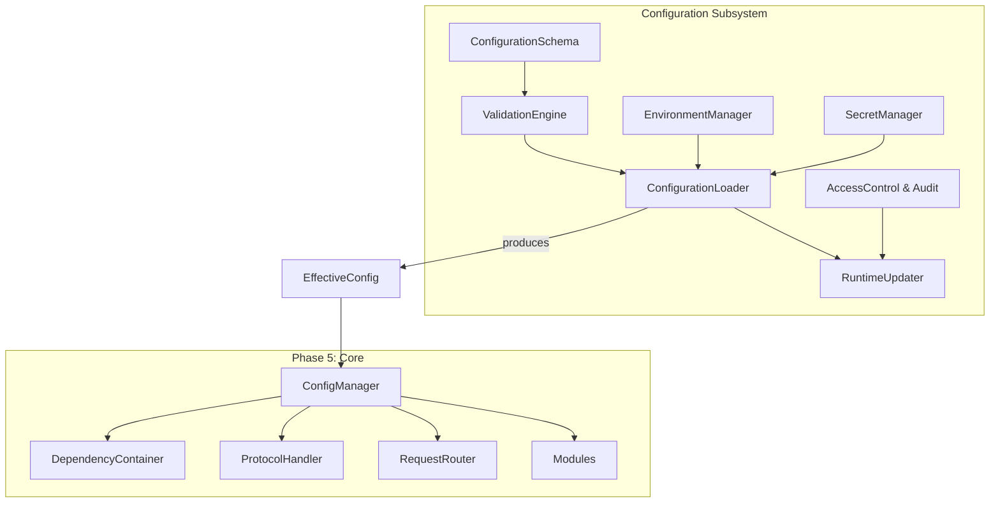
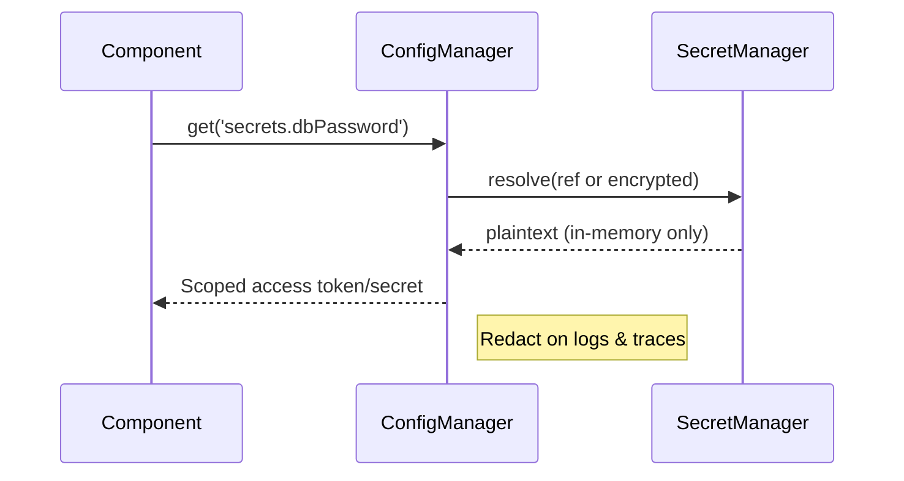
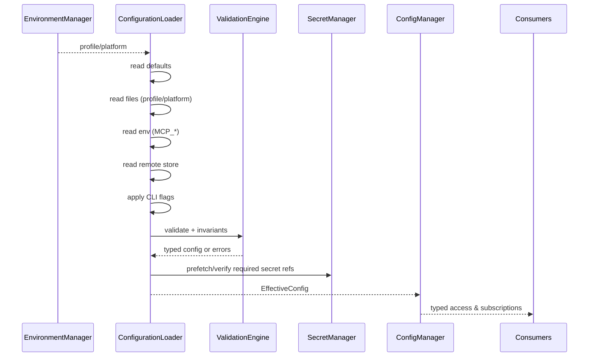
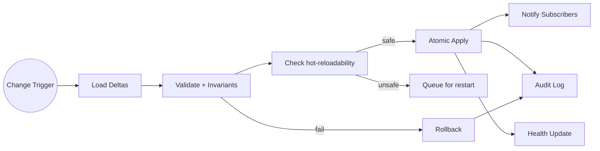
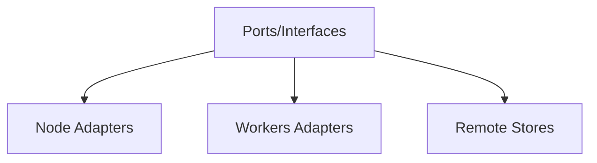

# Phase 6: Configuration System Architecture

This document defines a comprehensive, secure, and flexible configuration system for the Master MCP Server. It extends Phase 5’s Configuration Manager into a production‑grade subsystem with schema validation, multi‑environment layering, secure secret handling, hot‑reload, and cross‑platform adapters (Node.js and Cloudflare Workers).

## Goals and Scope
- Typed configuration with canonical schema and strong validation.
- Layered sources: defaults, files (JSON/YAML/TOML), env vars, remote stores, CLI, runtime overrides.
- Environment-aware with inheritance and platform‑specific sections.
- Secure handling of sensitive values: encryption at rest, key rotation, redaction, access control, audit trail.
- Safe hot‑reload for non‑critical settings; consistent behavior across Node.js and Workers.
- Cross‑platform abstractions for storage, crypto, time, and file watching.

---

## Core Components

- ConfigurationSchema: TypeScript-first, JSON Schema–backed definitions, including metadata (sensitivity, hot‑reloadability, ACL hints).
- ValidationEngine: JSON Schema validator (Ajv) + custom invariants and cross‑field constraints.
- EnvironmentManager: resolves effective environment (profile + platform) and layering order.
- ConfigurationLoader: parses and merges from all sources; produces a typed `EffectiveConfig`.
- SecretManager: pluggable secret resolution, encryption/decryption, rotation, redaction.
- RuntimeUpdater: orchestrates safe hot‑reload, atomic apply, rollback, back‑pressure, and audit events.
- AccessControl/Audit: read‑scoped config access, change authorization, append‑only audit log.
- PlatformAdapters: filesystem/KV, crypto, watchers/timers to support Node.js and Workers.



---

## Key Architectural Decisions

1) Schema format and validation
- Canonical format: JSON Schema draft 2020‑12. Portable across Node.js and Workers.
- Authoring: TypeScript + TypeBox to define schemas with types; generate JSON Schema for Ajv.
- Validation engine: Ajv (strict mode) with custom keywords for redaction, hot‑reload policy, and ACL hints.

2) Environment inheritance and override strategy
- Profiles: `development`, `test`, `staging`, `production`, plus optional `local` overlay.
- Layering: `defaults → profile → platform → file(s) → env → remote → CLI → runtime overrides`.
- Deterministic deep‑merge with per‑field merge policy (object: deep; arrays: replace by default; opt‑in append/unique semantics via schema metadata).

3) Secret management and encryption
- Sensitive values never stored or logged in plaintext; at rest encrypted using AES‑256‑GCM.
- Key management via pluggable Keyring: KMS (AWS/GCP/Azure), Cloudflare Workers Secrets, or local dev key.
- SecretRef indirection for remote secrets; uniform redaction and access control.

4) Hot‑reload mechanisms and safety
- Node: file watcher + debounced apply; atomic swap with rollback, rate limiting, and safety checks.
- Workers: periodic poll or event‑triggered fetch from remote store with ETag; only hot‑reloadable fields applied.

5) Source priority and merging
- Priority (low→high): Defaults < Files < Env < Remote < CLI < Runtime Overrides.
- All merges validated against the canonical schema; invariants checked post‑merge.

6) Error handling and reporting
- Startup fails fast on invalid effective config; emits structured error and suggested fixes.
- Runtime updates use transactional apply; on error, rollback and emit audit + health warning.

---

## Configuration Sources and Flow

Supported sources and unified merge flow:

```mermaid
flowchart TB
  Def[Defaults (in schema)] --> M[Merge]
  Prof[Profile file(s)] --> M
  Plat[Platform section] --> M
  Files[Config files JSON/YAML/TOML] --> M
  Env[Environment variables] --> M
  Remote[Remote config store] --> M
  CLI[Command-line flags] --> M
  RT[Runtime overrides] --> M
  M -->|validate+invariants| Eff[EffectiveConfig]
  Eff -->|typed| Consumers[ConfigManager + Components]
```

### File Formats
- JSON, YAML, TOML supported via adapters. Normalized into plain objects before merge.
- Recommended layout (VCS):
  - `config/default.yaml` (checked in, minimal secrets; safe defaults)
  - `config/development.yaml`, `config/test.yaml`, `config/staging.yaml`, `config/production.yaml`
  - `config/local.yaml` (gitignored)
  - Platform overlays: `config/platform.node.yaml`, `config/platform.workers.yaml`

### Environment Variables
- Prefix: `MCP_` by default; mapping to nested paths via `__` separator, e.g. `MCP_LOGGING__LEVEL=info` → `logging.level`.
- Type coercion: numbers, booleans, arrays (comma‑separated) with schema‑guided parsing.
- Sensitive env vars auto‑redacted in diagnostics.

### CLI Flags
- Mapped using dotted paths: `--logging.level=debug --server.maxConcurrent=128`.
- Parse via a minimal, cross‑platform parser (e.g., yargs) abstracted behind an interface.

### Remote Configuration
- Interface `RemoteConfigStore` with implementations:
  - Node: AWS SSM/Secrets Manager, GCP Secret Manager, Azure App Config, S3/GCS blobs.
  - Workers: Cloudflare KV/Durable Objects.
- Consistency: ETag/versioned reads; exponential backoff and jitter on failures.
- Authentication handled by platform credentials; no secrets in the repo.

### Merge Semantics
- Objects: deep merge (right overrides left).
- Arrays: replace by default; opt‑in behaviors per schema via `x-merge: { strategy: 'append'|'unique', key?: 'id' }`.
- Null/undefined: `undefined` means no override; `null` allowed only if permitted by schema.

---

## Schema Definition and Validation Patterns

### TypeScript-first with TypeBox + Ajv
```ts
// illustrative types
import { Type, Static } from '@sinclair/typebox'

// Custom metadata keys used by ValidationEngine
// x-sensitive: boolean, x-hotReload: 'never'|'safe'|'requires-restart'
// x-merge: { strategy: 'replace'|'append'|'unique', key?: string }

export const ServerSchema = Type.Object({
  maxConcurrent: Type.Integer({ minimum: 1, default: 64 }),
  idleTimeoutMs: Type.Integer({ minimum: 100, default: 30000, 'x-hotReload': 'safe' }),
})

export const LoggingSchema = Type.Object({
  level: Type.Union([
    Type.Literal('debug'), Type.Literal('info'), Type.Literal('warn'), Type.Literal('error')
  ], { default: 'info', 'x-hotReload': 'safe' }),
  redact: Type.Array(Type.String(), { default: ['token', 'authorization'], 'x-merge': { strategy: 'append' } }),
})

export const SecretRefSchema = Type.Union([
  Type.Object({ ref: Type.String(), required: Type.Optional(Type.Boolean({ default: true })) }),
  Type.Object({
    enc: Type.Literal('v1'),
    kid: Type.String(),
    iv: Type.String(),
    ct: Type.String(),
    tag: Type.Optional(Type.String()),
    createdAt: Type.Optional(Type.String()),
    'x-sensitive': true,
  })
])

export const EffectiveConfigSchema = Type.Object({
  env: Type.String({ default: 'development' }),
  platform: Type.Union([Type.Literal('node'), Type.Literal('workers')], { default: 'node' }),
  server: ServerSchema,
  logging: LoggingSchema,
  transports: Type.Object({
    http: Type.Optional(Type.Object({ port: Type.Integer({ default: 8080, 'x-hotReload': 'requires-restart' }) })),
    ws: Type.Optional(Type.Object({ port: Type.Integer({ default: 8081, 'x-hotReload': 'requires-restart' }) })),
    stdio: Type.Optional(Type.Object({ enabled: Type.Boolean({ default: false, 'x-hotReload': 'never' }) }))
  }),
  auth: Type.Object({
    providers: Type.Array(Type.Any(), { default: [] }),
    audience: Type.Optional(Type.String({ 'x-hotReload': 'safe' }))
  }),
  routing: Type.Object({
    retry: Type.Any({ default: {} }),
    breaker: Type.Any({ default: {} }),
    lb: Type.Union([
      Type.Literal('round_robin'), Type.Literal('least_latency'), Type.Literal('hashed')
    ], { default: 'round_robin', 'x-hotReload': 'safe' })
  }),
  modules: Type.Record(Type.String(), Type.Any({})),
  secrets: Type.Object({
    dbPassword: Type.Optional(SecretRefSchema),
    oauthClientSecret: Type.Optional(SecretRefSchema),
  }),
})

export type EffectiveConfig = Static<typeof EffectiveConfigSchema>
```

### Validation Engine
- Ajv configured in strict mode; compiled once at startup per schema version.
- Custom keywords:
  - `x-sensitive` → used for redaction and access control.
  - `x-hotReload` → drives RuntimeUpdater decisions.
  - `x-merge` → merge strategy hints.
- Cross‑field invariants implemented as post‑validators (e.g., `http.port` != `ws.port`).

### Validation Reporting
- Structure: `{ path, keyword, message, valueSample, severity, suggestion }`.
- Severity: `error` blocks apply; `warn` logs but continues (e.g., deprecated fields).
- Suggestions derived from schema defaults and allowed enums.

---

## Environment Management

### Profiles and Detection
- Profile detection: `MCP_ENV` preferred; fallback to `NODE_ENV`; default `development`.
- Platform detection: during build/runtime via adapters: `'node'` or `'workers'`.

### Inheritance and Overlays
```text
Effective = defaults
  → profile (development|test|staging|production)
  → platform overlay (node|workers)
  → files (e.g., config/production.yaml + config/local.yaml)
  → environment variables (MCP_*)
  → remote config (KV/SSM/etc.)
  → CLI flags
  → runtime overrides (admin API)
```

### Namespacing and Platform Sections
- Dedicated platform sections: `platform.node`, `platform.workers`; non‑applicable keys ignored with warning.
- Module configuration namespacing: `modules.<moduleName>.*` to isolate overrides and ACLs.

---

## Secret Management and Security Architecture

### Threat Model and Goals
- Prevent plaintext secrets at rest in files or remote stores.
- Minimize blast radius with key rotation and versioned encryption.
- Ensure secrets never appear in logs, metrics, or error messages.
- Control which components/principals may read specific secret scopes.

### Secret Representation
```json
{
  "enc": "v1",
  "kid": "key-2025-08",
  "iv": "base64-iv",
  "ct": "base64-ciphertext",
  "tag": "base64-tag",
  "createdAt": "2025-08-15T10:00:00Z"
}
```

Or by reference:
```json
{ "ref": "secrets/primary/dbPassword" }
```

### SecretManager Interfaces
```ts
interface SecretManager {
  resolve(ref: SecretRef | EncryptedValue): Promise<string>
  encrypt(plain: string, opts?: { kid?: string }): Promise<EncryptedValue>
  rotate(kid: string): Promise<void>
  keyring(): Keyring
}

interface Keyring {
  current(): { kid: string, keyBytes: ArrayBuffer }
  byId(kid: string): Promise<ArrayBuffer>
  rotate(newKey?: ArrayBuffer): Promise<string> // returns new kid
}

interface RemoteSecretsProvider {
  get(path: string): Promise<string | EncryptedValue>
}
```

### Crypto and Key Management
- Algorithm: AES‑256‑GCM with random 96‑bit IV; HKDF for key derivation if required.
- Node: Keyring backed by cloud KMS (preferred) or local dev key from `MCP_KMS_KEY`.
- Workers: Use `crypto.subtle` WebCrypto; keys provisioned via Workers Secrets; store only encrypted payloads in KV.
- Rotation: maintain `current` and `previous` keys; accept decrypt with both; re‑encrypt opportunistically.

### Redaction and Access Control
- Redaction: `ConfigManager.view({ redact: true })` masks any `x-sensitive` fields and SecretRefs.
- Access control: section‑scoped ACLs, e.g., `auth.providers.*` readable by Auth service only.
- Audit logging: append‑only records for read of sensitive sections (optional) and all writes; include actor, timestamp, diff summary, source, and outcome.



---

## ConfigurationLoader and Merging

### Loading Flow (Startup)


### Loading Flow (Runtime Update)


### Deterministic Merge
- Implemented via a controlled deep‑merge with schema‑aware decisions.
- Example policies:
  - `logging.redact` uses append semantics.
  - `transports.*.port` is `requires-restart` and cannot change at runtime.
  - `modules.*` treated as namespaced objects; per‑module keys may define their own `x-merge` rules.

---

## RuntimeUpdater (Hot‑Reload) Safety

### Constraints and Policies
- Only fields tagged with `x-hotReload: 'safe'` may change in place.
- Fields tagged `requires-restart` are rejected at runtime and queued for the next restart rollout.
- `never` marks fields immutable post‑startup (e.g., `stdio.enabled`).
- Rate limit updates per section (e.g., 1/minute) and overall (burst + token bucket).
- Debounce rapid file changes; coalesce multiple changes into single apply.

### Atomic Apply + Rollback
- Generation numbers for applied configs; each apply is transactional.
- Two‑phase apply: `prepare(delta)` → `commit()`; subscribers can veto in `prepare`.
- On failure: revert to previous generation; emit health warning and audit record.

### Subscriber API (illustrative)
```ts
interface ConfigSubscriber<T = unknown> {
  selectors: string[] // e.g., ['logging', 'routing']
  prepare(next: EffectiveConfig, prev: EffectiveConfig): Promise<{ ok: boolean, reason?: string }>
  commit(next: EffectiveConfig, prev: EffectiveConfig): Promise<void>
}
```

---

## Cross‑Platform Requirements

### Abstractions
- StorageBackend: filesystem (Node) vs KV/DO (Workers) for config and state.
- Watcher: chokidar (Node) vs poll/schedule (Workers).
- Crypto: Node `crypto` vs WebCrypto `crypto.subtle`.
- Clock/Timers: `setTimeout` vs Alarms/Scheduled triggers.



### Platform Defaults
- Node: enable file source and watcher; prefer local files + cloud remote store; KMS for keys.
- Workers: disable file source; enable KV/DO remote store; secrets in Workers Secrets; use ETag polling.

---

## Error Handling and Diagnostics

- Startup: if validation fails, emit structured errors with `path`, `message`, and `suggestion`; abort start.
- Runtime: on update failure, rollback with reason; expose diagnostic snapshot with redaction.
- Logging: structured logs with `configVersion`, `generation`, `source`, and `diffSummary`.
- Metrics: counters for `config_apply_success`, `config_apply_failure`, `config_rollback`, `config_update_skipped`.

---

## Security and Compliance

- Encryption at rest for any persisted sensitive value.
- Strict redaction for logs/errors; configurable allow‑list for non‑sensitive paths.
- Role‑based access control per section and per module namespace.
- Audit log: append‑only, tamper‑evident if supported by backend (e.g., hash chaining or DO log with integrity checks).
- Key rotation runbook: schedule, re‑encrypt secrets, dual‑read period, confirm, revoke old key.

---

## Examples

### Example YAML (development)
```yaml
env: development
platform: node
logging:
  level: debug
  redact: ["password", "authorization"]
server:
  maxConcurrent: 64
  idleTimeoutMs: 30000
transports:
  http: { port: 8080 }
auth:
  providers:
    - type: oauth
      clientId: my-client
      clientSecret: { ref: secrets/oauth/devClientSecret }
routing:
  lb: least_latency
secrets:
  dbPassword: { ref: secrets/dev/dbPassword }
modules:
  tools.search:
    endpoint: https://search.local
```

### Environment Variable Overrides
```bash
export MCP_LOGGING__LEVEL=info
export MCP_ROUTING__LB=round_robin
```

### CLI Overrides
```bash
node dist/server.js --logging.level=warn --modules.tools.search.endpoint=https://search.prod
```

### Illustrative Initialization
```ts
const env = environmentManager.detect()
const loader = new ConfigurationLoader({ env, remote: myRemoteStore, files: myFiles })
const result = await loader.load()
if (!result.ok) { throw new Error(result.errors.map(e => e.message).join('\n')) }

const effectiveConfig = result.value
const configManager = new ConfigManager(effectiveConfig, runtimeUpdater)
```

---

## Integration with Phase 5 Components

- ConfigManager remains the single injection point of `EffectiveConfig` and the subscription hub.
- RuntimeUpdater emits component‑scoped `prepare/commit` callbacks to ProtocolHandler, RequestRouter, MultiAuthManager, ModuleLoader, etc.
- SecretManager provided through DI with a platform‑specific Keyring.
- ValidationEngine lives beside ConfigManager; schema and validators versioned and cached.

---

## Deliverables Checklist
- ConfigurationSchema with TypeBox definitions and JSON Schema export.
- ValidationEngine with Ajv + custom keywords (`x-sensitive`, `x-hotReload`, `x-merge`).
- EnvironmentManager supporting profiles and platform overlays.
- ConfigurationLoader with multi‑source parsing and deterministic merge.
- SecretManager with encryption, SecretRef support, redaction, and key rotation.
- RuntimeUpdater with hot‑reload safety, atomic apply, rollback, and audit logging.
- Platform adapters for Node.js and Workers (files, KV, crypto, timers, watchers).

---

## Appendix: Hot‑Reload Safety Matrix (Illustrative)

| Section                | Policy             | Notes                                 |
|------------------------|--------------------|---------------------------------------|
| logging.level          | safe               | Immediate effect on logger            |
| logging.redact         | safe               | Expand redact list                    |
| server.idleTimeoutMs   | safe               | Applies to new connections/sessions   |
| transports.http.port   | requires-restart   | Requires listener rebind              |
| transports.stdio       | never              | Static transport choice               |
| routing.lb             | safe               | Router recomputes strategy            |
| auth.providers         | requires-restart   | Re‑instantiate auth provider clients  |
| modules.*              | depends            | Module declares policy per key        |

