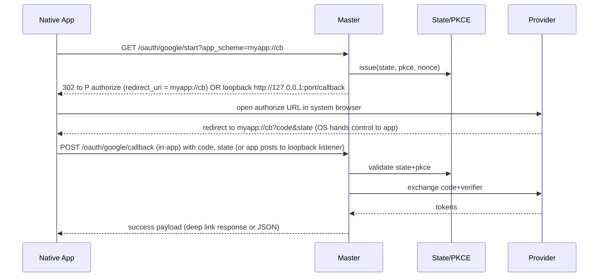
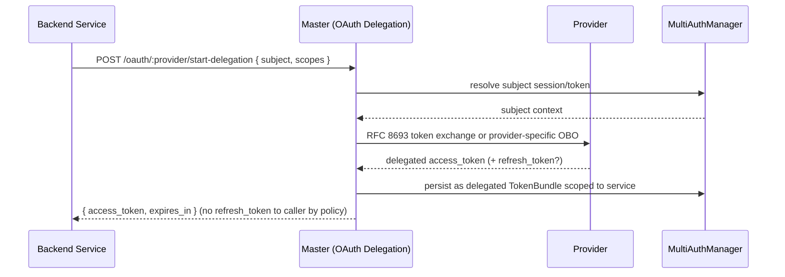
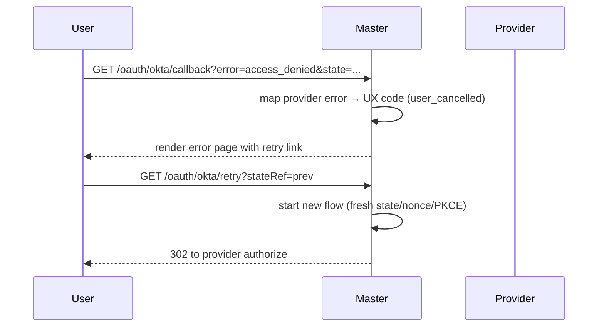
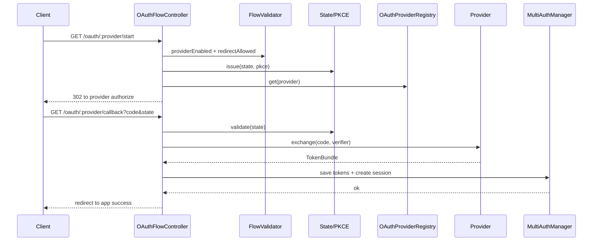

# Phase 7: OAuth Flow Handling Architecture

This document defines the comprehensive OAuth flow handling system for the Master MCP Server. It builds on Phases 1–6 to provide secure, user‑friendly, and provider‑agnostic OAuth authorization flows with PKCE, state/nonce protections, accessible web interfaces, and deep integration with the existing authentication system and configuration framework.


## Goals and Scope
- First‑class Authorization Code with PKCE for public clients (web, mobile, desktop/CLI).
- Delegation and on‑behalf‑of (OBO) flows for backend and multi‑service topologies.
- Provider‑specific customizations while preserving a stable core abstraction.
- Mobile‑friendly, accessible, internationalized consent and callback pages.
- Robust security: PKCE, state, nonce (OIDC), strict redirect validation, replay protection.
- End‑to‑end integration with MultiAuthManager (Phase 2), RequestRouter (Phase 3–4), and ConfigManager (Phase 5–6).
- Cross‑platform deployability: Node.js and edge/serverless (Cloudflare Workers) with consistent behavior.

---

## Core Components

- OAuthFlowController: Orchestrates end‑to‑end flows; routes start/callback/retry; coordinates PKCE/State and invokes providers.
- PKCEManager: Generates S256 code verifier/challenge, validates method support, and binds to session state.
- StateManager: CSRF state and OIDC nonce issuance/validation; single‑use, time‑bounded entries.
- CallbackHandler: Validates callback requests, performs token exchange, handles error mapping and idempotency.
- WebInterfaceRenderer: Renders HTML pages (start/consent/success/error/retry) with i18n, branding, and accessibility.
- FlowValidator: Centralized validation and security checks (redirect allowlist, provider enablement, policy gates).

Supporting services from prior phases:
- MultiAuthManager (Phase 2): Strategy selection and token lifecycle; receives final TokenBundle.
- OAuthProviderRegistry (Phase 2): Provider abstraction (buildAuthUrl, refresh, revoke, userinfo, etc.).
- RequestRouter (Phase 3–4): Endpoint routing, circuit breaker and retry around provider network calls.
- ProtocolHandler + DependencyContainer (Phase 5): Wiring and lifecycle.
- ConfigManager (Phase 5–6): Typed settings for providers, UI, security, and platform adapters.

```mermaid
classDiagram
  class OAuthFlowController {
    +start(req): HttpResponse
    +callback(req): HttpResponse
    +retry(req): HttpResponse
    -pkce: PKCEManager
    -state: StateManager
    -cb: CallbackHandler
    -ui: WebInterfaceRenderer
    -validator: FlowValidator
    -auth: MultiAuthManager
  }

  class PKCEManager {
    +issue(): {verifier:string, challenge:string, method:'S256'}
    +hash(verifier): string
    +validate(verifier, storedHash): boolean
  }

  class StateManager {
    +issue(input): Promise~StateToken~
    +validate(stateToken): Promise~StateRecord~
    +invalidate(id): Promise~void~
  }

  class CallbackHandler {
    +exchange(provider, code, verifier, redirectUri): Promise~TokenBundle~
    +finalize(session, tokens): Promise~HttpResponse~
  }

  class WebInterfaceRenderer {
    +render(page, model, locale): HttpResponse
  }

  class FlowValidator {
    +checkProviderEnabled(providerId)
    +checkRedirectAllowed(providerId, redirectUri)
    +checkPkceRequired(providerId)
    +checkScopesAllowed(providerId, scopes)
  }

  OAuthFlowController --> PKCEManager
  OAuthFlowController --> StateManager
  OAuthFlowController --> CallbackHandler
  OAuthFlowController --> WebInterfaceRenderer
  OAuthFlowController --> FlowValidator
  OAuthFlowController --> MultiAuthManager
```

---

## Endpoint Structure and Routing

Canonical OAuth endpoints (mounted under configurable `basePath`, default `/oauth`):
- `GET  /oauth/:provider/start` → Initiate flow; creates state/PKCE; redirects to provider authorize URL or renders interstitial consent.
- `GET  /oauth/:provider/callback` → Process provider callback; validate state/nonce; exchange code for tokens; finalize.
- `POST /oauth/:provider/refresh` → Refresh token (server‑side, no UI). Integrates with TokenManager.
- `POST /oauth/:provider/revoke` → Revoke tokens (server‑side, audit).
- `GET  /oauth/:provider/status` → Minimal session/connection status (redacted diagnostics; no secrets).
- `GET  /oauth/:provider/retry` → Restart flow after recoverable error (UI page → redirect to `start`).

Routing rules:
- RequestRouter maps `/:provider/*` to OAuthFlowController. FlowValidator checks provider enablement and policy before executing.
- Circuit breakers and retry (Phase 4) wrap network calls to providers (discovery, token exchange). UI pages surface retry affordances.
- Base path support (`/mcp/oauth/...`) for reverse proxies; use ConfigManager for `server.basePath`.

---

## OAuth Flow Sequences

### 1) Authorization Code + PKCE (Web)
```mermaid
sequenceDiagram
  participant U as User Agent (Browser)
  participant M as Master (OAuthFlowController)
  participant ST as StateManager/PKCE
  participant P as OAuth Provider
  participant AU as MultiAuthManager

  U->>M: GET /oauth/github/start?redirect=/app
  M->>ST: issue state+nonce+pkce
  ST-->>M: {state, nonce, pkceHash, verifierCookie}
  M->>P: 302 to authorize?client_id&redirect_uri&state&code_challenge&code_challenge_method=S256&scope
  U->>P: GET /authorize ...
  P-->>U: 302 back to M /callback?code&state
  U->>M: GET /oauth/github/callback?code&state
  M->>ST: validate state (single-use) + pull pkce hash + nonce
  ST-->>M: ok
  M->>P: POST /token { code, code_verifier, redirect_uri }
  P-->>M: { access_token, refresh_token, id_token?, expires_in }
  M->>AU: save TokenBundle; establish session; link user
  AU-->>M: ok
  M-->>U: 302 to original redirect (/app) or success page
```

State storage options: ephemeral keyed by `state` with TTL 10 minutes. Store hashed `code_verifier` (S256) rather than plaintext.

### 2) Mobile/Desktop (Loopback or App Scheme)


Notes:
- For public native clients, prefer app scheme or loopback redirect with PKCE. No client secret.
- When app cannot receive inbound deep links, use loopback with ephemeral local server or out‑of‑band return URL with one‑time code exchange endpoint.

### 3) Delegation / On‑Behalf‑Of (Backend)


Notes:
- Prefer RFC 8693 Token Exchange when supported; otherwise use provider OBO APIs (e.g., Azure AD `on_behalf_of`).
- Delegated tokens are stored and rotated by Master; services receive short‑lived access tokens only.

### 4) Error + Retry Flow


---

## Web Interface Architecture

### Rendering Approach
- Templates: Use a small, logic‑lite, universal templating engine (Eta or Mustache). Precompile where possible for performance; runtime rendering works in Workers and Node.
- Security: Escape by default; no untrusted HTML injection. Content Security Policy (CSP) with `default-src 'self'; frame-ancestors 'none'; base-uri 'none'; form-action 'self'` and nonced inline styles/scripts when absolutely necessary.
- Delivery: Pages served by WebInterfaceRenderer via RequestRouter. Cache‑control set to `no-store` for auth pages.

### Page Types
- Consent/Start Interstitial: Show provider name, scopes summary, and continue button; optional when UX requires.
- Success Page: Friendly confirmation; auto‑redirect to `redirect` target with `window.location.replace()` using a nonced inline script.
- Error Page: Clear categorization (cancelled, misconfigured, unavailable); includes retry and a support reference ID.
- Status Page: Minimal, redacted session info for debugging (development only by default).

### Internationalization (i18n)
- Locale detection: `Accept-Language`, `ui.lang` query param, or session. Fallback to `en`.
- Resource bundles: JSON dictionaries under `i18n/<locale>.json` keyed by stable message IDs; loaded at startup via ConfigManager.
- Pluralization/gender: Keep scope minimal; rely on ICU message format if needed in future iterations.

### Accessibility and UX
- Semantic HTML; headings and landmarks; ARIA for dynamic content.
- Full keyboard support; visible focus states; color-contrast compliant.
- Motion reduced; respect `prefers-reduced-motion` and `prefers-color-scheme`.
- Error pages describe resolution paths, avoid technical jargon, and never leak secrets.

### Branding and Theming
- Configurable provider display name, logo URL (fetched from allowlisted domains), and theme tokens (colors, dark mode).
- High‑DPI safe images; alt text and localized content.

---

## Security Architecture

### PKCE for Public Clients
- Always prefer `S256` method. PKCEManager creates random 32–64 byte verifier, derives S256 challenge.
- Store only a salted hash of the verifier in ephemeral state. Accept verifier only once during code exchange.

### State and Nonce (CSRF/OIDC)
- StateManager issues `state` with TTL (10 min) and marks single‑use on validation.
- OIDC nonce bound to state and optionally user agent; validated against `id_token` claim.
- Transport binding: bind state to an HttpOnly, Secure, SameSite=Lax cookie carrying a random session key; Store only the session key server‑side.

### Redirect URI Validation
- Strict allowlist per provider and environment. Exact string or prefix match only for trusted schemes: `https://` origins, `http://127.0.0.1` loopback, and registered custom app schemes.
- Disallow dynamic hostnames unless explicitly allowlisted; reject mixed‑scheme or embedded credentials.

### Session Security and Timeouts
- No tokens in query strings or page content. Access/refresh tokens never rendered to the browser.
- Short‑lived flow state (10 min), session cookie rotation on completion, and logout revocation endpoint.
- Idempotent callback handling: repeated `code` or `state` yields a safe error page without leaking existence of tokens.

### Headers and Transport
- HSTS, X‑Content‑Type‑Options, Referrer‑Policy, and frame busting via `frame-ancestors 'none'`.
- CSP nonces per page render; disallow inline scripts except with generated nonces.

### Abuse Prevention
- Rate limits per IP/user on `/start` and `/callback`; exponential backoff after failures; optional CAPTCHA in high‑risk scenarios.
- Replay protection by marking state consumed; store seen `code` values for a short TTL to detect and reject replay.

### Secrets and Keys
- Integrates with Phase 6 SecretManager for provider client secrets (when used) and encryption keys.
- All logs and metrics strictly redact tokens; include hashed references only.

---

## Integration with Existing Components

- MultiAuthManager (Phase 2): CallbackHandler delivers TokenBundle and user identity; strategy emits AuthResult for session issuance. Refresh/revoke endpoints forward to TokenManager via strategy methods.
- OAuthProviderRegistry (Phase 2): Provider discovery, JWKS, token endpoints abstracted. Provider‑specific parameters injected via configuration and per‑provider hooks.
- RequestRouter (Phase 3–4): Registers OAuth endpoints; wraps network calls with retry/backoff and circuit breakers; preserves idempotency keys for callbacks.
- ProtocolHandler (Phase 5): Exposes OAuth flow initiation as protocol actions if needed; allows tools to request authorization.
- ConfigManager (Phase 5–6): Central source of truth for `auth.providers`, `ui.oauth`, `security.redirects`, `server.basePath`, `platform.*`.
- DependencyContainer (Phase 5): Wires PKCEManager, StateManager store adapters, WebInterfaceRenderer engine, and FlowValidator policies.
- Logging/Monitoring: Structured logs (`event='oauth.*'`) and OpenTelemetry spans around key stages: `oauth.start`, `oauth.callback`, `oauth.exchange`, `oauth.refresh`, `oauth.revoke`.

---

## Provider-Specific Customization

Mechanisms:
- Per‑provider hook interface: `beforeAuthorize(params)`, `afterTokenExchange(bundle)`, `mapUserInfo(raw)`, `additionalHeaders()`.
- Configurable extras injected into authorize request: e.g., Google `access_type=offline&prompt=consent`, Azure AD `resource` or `tenant`, Okta `prompt`/`idp`.
- Scope policy: allowlist + transform; FlowValidator enforces allowed scopes per provider/tenant.
- Display: provider branding (name, logo, legal links), localized scope descriptions.

Example authorize param assembly:
```ts
const base = { response_type: 'code', client_id, redirect_uri, scope: scopes.join(' '), state, code_challenge, code_challenge_method: 'S256' };
const params = provider.beforeAuthorize ? provider.beforeAuthorize(base, ctx) : base;
return new URLSearchParams(params);
```

---

## Configuration Model (Phase 6 Integration)

Schema sketch (TypeScript/TypeBox style):
```ts
export const OAuthProviderSchema = Type.Object({
  id: Type.String(), // 'github', 'google', 'azure', 'okta'
  kind: Type.Union([ Type.Literal('oidc'), Type.Literal('oauth2') ], { default: 'oauth2' }),
  clientId: Type.String(),
  clientSecret: Type.Optional(SecretRefSchema), // not used for public native clients
  discoveryUrl: Type.Optional(Type.String()), // for OIDC
  authUrl: Type.Optional(Type.String()),
  tokenUrl: Type.Optional(Type.String()),
  revocationUrl: Type.Optional(Type.String()),
  jwksUrl: Type.Optional(Type.String()),
  defaultScopes: Type.Array(Type.String(), { default: [] }),
  allowedRedirects: Type.Array(Type.String(), { default: [] }),
  pkceRequired: Type.Boolean({ default: true }),
  extraAuthorizeParams: Type.Record(Type.String(), Type.String(), { default: {} }),
  branding: Type.Object({ name: Type.String(), logoUrl: Type.Optional(Type.String()) }, { default: { name: '' } }),
  ui: Type.Object({ theme: Type.Optional(Type.String()), consentInterstitial: Type.Boolean({ default: false }) }, { default: {} }),
});

export const OAuthUiSchema = Type.Object({
  basePath: Type.String({ default: '/oauth' }),
  i18n: Type.Object({ defaultLocale: Type.String({ default: 'en' }), supported: Type.Array(Type.String(), { default: ['en'] }) }),
  csp: Type.Boolean({ default: true }),
});
```

---

## Storage and State Adapters

- Ephemeral State Store: Interface `EphemeralStore` with `get/set/delete` and TTL. Implementations:
  - Node: In‑memory (dev), Redis (prod), or process‑local LRU with TTL for single‑node.
  - Workers: Cloudflare KV or Durable Objects (preferred for consistency).
- Session Binding: Session key kept in HttpOnly cookie; state entries are bound to this key to prevent CSRF.
- Idempotency: Store processed `code` values for a short TTL to detect and reject replayed callbacks.

---

## Mobile and Responsive Design

- Responsive Layout: Fluid grid and typography; tap targets ≥44px; safe areas on iOS; respect `viewport-fit=cover`.
- Deep Links: `myapp://callback` support with allowlist; provide QR fallback for desktop‑to‑mobile handoff in CLI scenarios.
- Loopback: `http://127.0.0.1:<random-port>/callback` for desktop/CLI; require PKCE and strict 127.0.0.1 host.
- Copy‑code Fallback: Render a one‑time code and link to paste into app if deep link fails.

---

## Error Handling and UX Flows

Error taxonomy:
- user_cancelled: User denied consent or closed the window.
- provider_unavailable: Network/provider outage; suggest retry.
- misconfiguration: Redirect, client, or scope mismatch; show admin contact instructions.
- state_invalid | nonce_invalid | pkce_invalid: Security failures; encourage restart; audit at high severity.
- already_linked | session_expired: Provide clear next steps.

UX rules:
- Always provide a safe retry path that issues a fresh state/nonce/PKCE.
- Never display raw provider errors or secrets; map to friendly codes with support reference ID.
- Include back link to application, preserving original intent where possible.

---

## Observability and Audit

- Logs: `event='oauth.start' | 'oauth.callback' | 'oauth.exchange' | 'oauth.refresh' | 'oauth.revoke' | 'oauth.error'` with fields: `provider`, `tenant`, `userKeyHash`, `stateId`, `result`, `durationMs`. All tokens redacted.
- Metrics: counters/gauges: `oauth_start_total`, `oauth_callback_total`, `oauth_exchange_errors_total{reason}`, `oauth_latency_ms{stage}`.
- Tracing: Spans around provider calls; attributes: `oauth.provider`, `oauth.scopes`, `oauth.redirect_origin`.
- Audit: Append‑only records for token issuance/revocation and delegation/OBO with actor and scope details.

---

## Cross‑Platform Deployment

Node.js (server/process):
- Use filesystem templates bundled at build; Redis or in‑memory state store; HTTPS termination via reverse proxy.
- Support loopback redirect for desktop/CLI; ensure `127.0.0.1` hosts only.

Cloudflare Workers / Edge:
- Use precompiled templates or inline templates; KV/DO for state; fetch‑based HTTP; no Node‑specific APIs.
- Avoid libraries that require Node crypto; rely on WebCrypto for PKCE hashing and nonce.

Containers / Proxies:
- Respect `X-Forwarded-*` and `Forwarded` headers for redirect URL construction; validate `publicBaseUrl` from config.
- Honor `server.basePath` for path rewriting; generate absolute redirect URIs consistently.

Multi‑tenant:
- Namespace state entries by tenant; isolate provider configs; per‑tenant branding and allowlists.

---

## Minimal Interfaces (TypeScript Sketch)

```ts
export interface OAuthFlowController {
  start(req: HttpRequest): Promise<HttpResponse>;
  callback(req: HttpRequest): Promise<HttpResponse>;
  retry(req: HttpRequest): Promise<HttpResponse>;
}

export interface PKCEManager {
  issue(): Promise<{ verifier: string; challenge: string; method: 'S256'; hash: string }>;
  validate(verifier: string, expectedHash: string): boolean;
}

export interface StateManager {
  issue(input: { provider: string; redirect: string; nonce?: string; codeVerifierHash: string; sessionKey: string; ttlSec?: number }): Promise<{ state: string; id: string; ttlSec: number; nonce?: string }>;
  validate(state: string, sessionKey: string): Promise<{ id: string; provider: string; redirect: string; nonce?: string; codeVerifierHash: string }>;
  invalidate(id: string): Promise<void>;
}

export interface CallbackHandler {
  handle(input: { providerId: string; code: string; verifier: string; redirectUri: string; stateRef: string }): Promise<{ tokens: TokenBundle; user?: UserInfo }>;
}

export interface WebInterfaceRenderer {
  render(page: 'consent'|'success'|'error'|'status', model: Record<string, unknown>, locale?: string): Promise<HttpResponse>;
}

export interface FlowValidator {
  providerEnabled(providerId: string): void;
  redirectAllowed(providerId: string, redirect: string): string; // returns normalized URI
  scopesAllowed(providerId: string, scopes: string[]): void;
  pkceRequired(providerId: string): boolean;
}
```

---

## Sequence Integration with MultiAuthManager



---

## Implementation Notes and Defaults

- PKCE: Enforce S256; reject `plain` except in explicitly allowed dev mode.
- State TTL: 10 minutes default; configurable per provider.
- Idempotency: Store hash(code) for 10 minutes after success; repeated callbacks return success page or no‑op.
- CSP: Enabled by default; nonce injected via DependencyContainer’s crypto service.
- Templates: Prefer precompiled Eta templates packaged under `assets/templates/oauth/*.eta`.
- Errors: Map provider error codes to internal taxonomy; include `supportRefId` (KSUID/ULID) in UI and logs.

---

## Deliverables Coverage Checklist

- Detailed flow components and interfaces (OAuthFlowController, PKCEManager, StateManager, CallbackHandler, WebInterfaceRenderer, FlowValidator).
- OAuth flow types: Auth Code + PKCE, delegation/OBO, provider customizations, mobile and error/retry flows.
- Web interface architecture: templating, branding, i18n, accessibility, security UX.
- Security architecture: PKCE, state, nonce, redirect validation, headers, replay protection.
- Integration patterns with Phase 2–6 components; routing and observability.
- Cross‑platform differences: Node, Workers, containers/proxies, multi‑tenant.
- Multiple sequence diagrams covering core and edge flows.

---

## Appendix: Example Error Mapping Table (excerpt)

| Provider error | Internal code      | HTTP | UX Message Key            |
| -------------- | ------------------ | ---- | ------------------------- |
| access_denied  | user_cancelled     | 302  | oauth.error.userCancelled |
| server_error   | provider_unavailable| 503 | oauth.error.providerDown  |
| invalid_client | misconfiguration    | 500 | oauth.error.misconfigured |
| invalid_state  | state_invalid       | 400 | oauth.error.stateInvalid  |
| invalid_nonce  | nonce_invalid       | 400 | oauth.error.nonceInvalid  |
