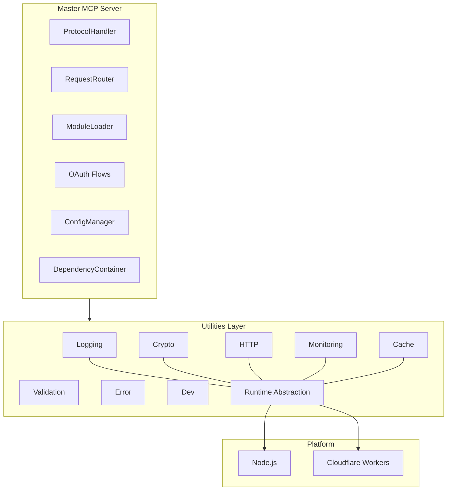
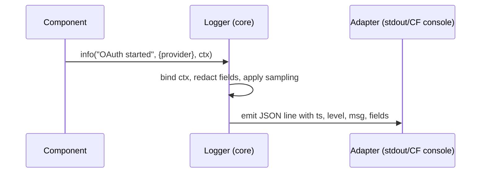
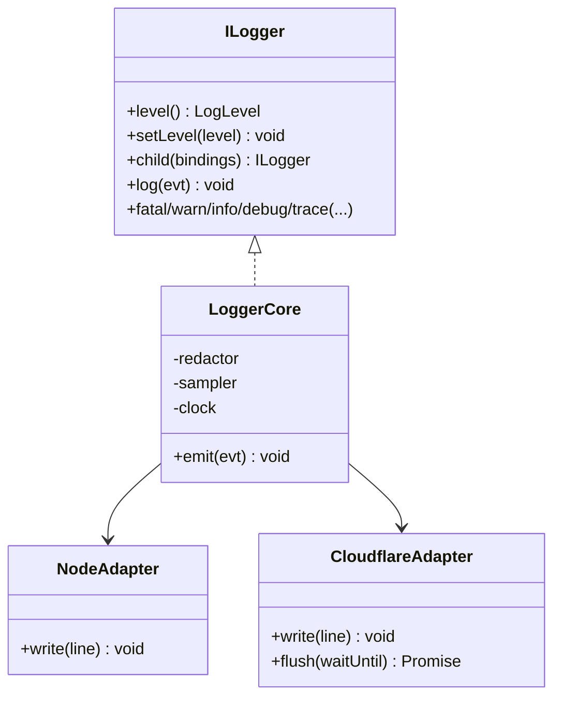
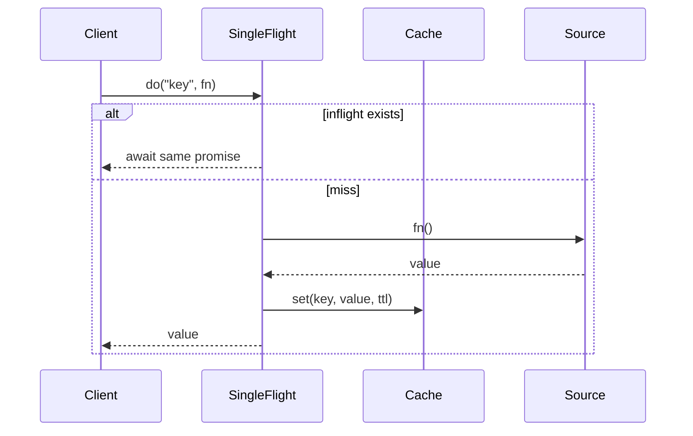

# Phase 8: Utilities and Helpers Architecture

Status: Design • Targets: Node.js 18+/20+ and Cloudflare Workers (2023+)

This document specifies the Master MCP Server utilities and helpers layer that provides foundational, cross‑cutting capabilities used by all phases and modules: logging, crypto, validation, HTTP, monitoring, caching, error handling, and development helpers. The design emphasizes cross‑platform portability, security, performance, and composability.


## Goals and Non‑Goals

- Goals:
  - Consistent, platform‑agnostic utility APIs with pluggable adapters
  - Secure defaults and hardened implementations (crypto, validation, error handling)
  - Low‑overhead, production‑grade logging and metrics with rich context
  - Composable building blocks that integrate cleanly with Phases 1–7
  - Configuration‑driven behavior; graceful degradation if a capability is unavailable
- Non‑Goals:
  - Mandating a single external vendor (e.g., metrics backend, KMS, cache). Provide ports; adapters can be swapped.
  - Re‑implementing full frameworks (e.g., OpenTelemetry SDK). We define minimal ports and provide an OTEL adapter.


## High‑Level Architecture

We use a Ports and Adapters (Hexagonal) architecture. Each utility category defines:
- Port interfaces (stable, platform‑agnostic APIs)
- Core helpers (pure logic; small, dependency‑free where possible)
- Platform adapters (Node, Cloudflare Workers, and optional vendor adapters)
- Factories (config‑driven construction via DependencyContainer)

```text
src/
  utils/
    logging/        # ILogger port, core, adapters/{node,cf,otel,...}
    crypto/         # ICrypto, KeyRing, KDF, envelope, adapters/{node,web}
    validation/     # IValidator, Sanitizer, schema registry
    http/           # IHttpClient, Request/Response helpers, headers/cookies
    monitoring/     # IMetrics, ITracer, HealthCheckRegistry
    cache/          # ICache, IAsyncLock, SingleFlight, adapters/{memory,redis,kv}
    error/          # AppError, ErrorMapper, recovery helpers
    dev/            # debug toggles, pretty log, fixtures, test doubles
    platform/       # Runtime Abstraction Layer (fetch, crypto, timers)
    index.ts        # Barrel exports
```

### Utilities Layer in Context




## Cross‑Platform Abstraction Strategy

- Runtime Abstraction Layer (RAL): provides minimal, typed shims for platform differences:
  - `crypto` (WebCrypto subset), `randomBytes`, `timers` (monotonic), `fetch`, `TextEncoder/Decoder`, `env`, `storage` (ephemeral for Workers)
  - Node adapter maps to `globalThis.crypto` (Node 18+), `node:crypto` for non‑WebCrypto ops, `undici` for fetch.
  - Cloudflare adapter uses Workers `crypto.subtle`, `caches.default`, KV/D1/DO as configured; `fetch` is native.
- Strategy: Prefer Web Platform APIs (Fetch, Request/Response, Headers, WebCrypto) as the common denominator. Use Node adapters to normalize to web standards where needed.
- Efficient resource usage for Workers: avoid long‑lived buffers, batch I/O, and prefer streaming APIs; respect `ctx.waitUntil` hooks via a thin callback in adapters when present.


## Common API Patterns

- Context‑first APIs: methods accept an optional `Context` with correlation/trace ids, tenant/user, and redaction policy.
- Factory construction: `createXxx(config, platform, dependencies)` returns a concrete adapter bound to config and shared facilities (logger, metrics).
- Async and cancellation: methods return `Promise<T>` and accept optional `AbortSignal`.
- Error semantics: utilities throw `AppError` (see Error Helpers) with category, code, severity, retryability.
- Minimal surface area: narrowly scoped, composable primitives; avoid implicit globals.

```ts
export type Context = {
  requestId?: string;
  traceId?: string;
  userId?: string;
  tenantId?: string;
  labels?: Record<string, string>;
  abortSignal?: AbortSignal;
};
```


## Logging Utilities

Objectives: structured JSON logs, low overhead, correlation, redaction, dynamic levels, child loggers, and consistent sinks across Node/CF.

### Port and Core

```ts
export type LogLevel = "fatal"|"error"|"warn"|"info"|"debug"|"trace";
export interface LogEvent {
  level: LogLevel;
  msg: string;
  ts: number;             // epoch millis (monotonic offset applied)
  ctx?: Context;          // request/user/trace context
  fields?: Record<string, unknown>; // structured key/values
  err?: { name: string; message: string; stack?: string; code?: string };
}

export interface ILogger {
  level(): LogLevel;
  setLevel(level: LogLevel): void;
  child(bindings: Record<string, unknown>): ILogger;
  log(evt: Omit<LogEvent, "ts">): void; // ts added by core
  fatal(msg: string, fields?: object, err?: Error, ctx?: Context): void;
  error(msg: string, fields?: object, err?: Error, ctx?: Context): void;
  warn(msg: string, fields?: object, ctx?: Context): void;
  info(msg: string, fields?: object, ctx?: Context): void;
  debug(msg: string, fields?: object, ctx?: Context): void;
  trace(msg: string, fields?: object, ctx?: Context): void;
}
```

Core features:
- Monotonic timestamps and fast JSON encoding
- Redaction list from config (e.g., headers `authorization`, PII fields)
- Sampling policies (by level, by route, by user/tenant)
- Child bindings auto‑include module name/phase; request scope via `child({ requestId, traceId })`

### Adapters

- Node: writes to `process.stdout` as JSON lines; optional `pino`/`bunyan` adapter; OTLP exporter via monitoring adapter.
- Cloudflare: uses `console` JSON logs; honors `ctx.waitUntil` to flush batched logs; supports Workers Logpush/Analytics via monitoring.

### Sequence




## Crypto Utilities

Objectives: secure primitives with safe defaults, constant‑time comparisons, key management, and envelope encryption. Use WebCrypto where possible.

### Port

```ts
export interface ICrypto {
  randomBytes(len: number): Uint8Array;
  timingSafeEqual(a: Uint8Array, b: Uint8Array): boolean;
  hash(input: Uint8Array | string, alg: "SHA-256"|"SHA-512"): Promise<Uint8Array>;
  hmac(key: Uint8Array, data: Uint8Array | string, alg?: "SHA-256"): Promise<Uint8Array>;
  deriveKey(password: Uint8Array | string, salt: Uint8Array, opts: { kdf: "scrypt"|"pbkdf2"|"hkdf"; iterations?: number; length: number }): Promise<Uint8Array>;
  encrypt(plaintext: Uint8Array, keyRef: KeyRef, opts?: { aad?: Uint8Array }): Promise<{ nonce: Uint8Array; ciphertext: Uint8Array; tag?: Uint8Array }>;
  decrypt(ciphertext: Uint8Array, keyRef: KeyRef, opts: { nonce: Uint8Array; aad?: Uint8Array; tag?: Uint8Array }): Promise<Uint8Array>;
}

export type KeyRef = { id: string; usage: "enc"|"mac"|"wrap"; }; // resolved via KeyRing

export interface KeyRing {
  get(keyId: string): Promise<CryptoKey | Uint8Array>; // platform specific
  rotate(policy?: RotationPolicy): Promise<void>;
}
```

### Security Patterns

- AES‑GCM for authenticated encryption; XChaCha20‑Poly1305 if supported in Node adapter (optional)
- HKDF (SHA‑256) for key derivation within system; scrypt for password‑based derivation
- Random nonces via CSPRNG; never reuse nonces
- Constant‑time compare for tokens/secrets (`timingSafeEqual`)
- Envelope encryption: locally derived DEK, wrapped by KEK in `KeyRing` (pluggable KMS)
- Zeroization: overwrite sensitive buffers when possible; avoid retaining in closures
- Key separation: distinct keys per purpose; include context (aad) during encryption

### Adapters

- Node: `node:crypto` + WebCrypto; optional KMS (`aws-kms`, `gcp-kms`) via thin KeyRing adapters
- Cloudflare: WebCrypto; secrets provided via environment bindings; optional Durable Object for rotation bookkeeping


## Validation Helpers

Objectives: input validation and sanitization with schema registry and unified error reporting.

### Port

```ts
export interface ISchema<T = unknown> { id: string; jsonSchema: unknown }
export interface IValidator {
  compile<T>(schema: ISchema<T>): void; // cache compiled validators
  validate<T>(schemaId: string, data: unknown): { ok: true; value: T } | { ok: false; issues: ValidationIssue[] };
  sanitize<T>(schemaId: string, data: unknown): { ok: true; value: T } | { ok: false; issues: ValidationIssue[] };
}
export type ValidationIssue = { path: string; code: string; message: string };
```

Implementation strategy:
- Prefer JSON Schema (2020‑12) for interop with Phase 6 config validation
- Node: AJV adapter with code generation disabled in serverless; enable in long‑lived Node processes
- Cloudflare: lightweight AJV build; cache compiled validators in memory within the request scope
- Sanitization: field trimming, canonicalization (e.g., emails), safe defaults injected by schema


## HTTP Utilities

Objectives: unify Request/Response handling across Node and Workers; header and cookie helpers; safe redirects; small client wrapper with retries and backoff.

### Port

```ts
export interface IHttpClient {
  fetch(input: RequestInfo, init?: RequestInit & { ctx?: Context; retry?: RetryPolicy }): Promise<Response>;
}
export type RetryPolicy = { attempts: number; backoffMs?: number; retryOn?: number[] };

export interface IHeaders {
  get(header: string): string | null;
  set(header: string, value: string): void;
  append(header: string, value: string): void;
  delete(header: string): void;
}

export interface CookieJar {
  get(name: string): string | undefined;
  set(name: string, value: string, opts?: { httpOnly?: boolean; secure?: boolean; sameSite?: "Lax"|"Strict"|"None"; path?: string; domain?: string; maxAge?: number }): void;
  delete(name: string): void;
}
```

Strategies:
- Prefer Web Fetch API everywhere; Node adapter uses Undici if necessary
- Helpers for `Cache-Control`, ETag generation (strong/weak hashes via crypto), `X-Request-Id` propagation
- Safe URL building, query serialization; header normalization and redaction for logs


## Monitoring Utilities

Objectives: counters, histograms, gauges, health checks, and optional tracing. Minimal overhead with pluggable exporters.

### Port

```ts
export interface Counter { inc(v?: number, labels?: Record<string,string>): void }
export interface Histogram { observe(v: number, labels?: Record<string,string>): void }
export interface Gauge { set(v: number, labels?: Record<string,string>): void }
export interface Timer { stop(labels?: Record<string,string>): void }
export interface IMetrics {
  counter(name: string, help?: string, labelNames?: string[]): Counter;
  histogram(name: string, help?: string, buckets?: number[], labelNames?: string[]): Histogram;
  gauge(name: string, help?: string, labelNames?: string[]): Gauge;
  startTimer(name: string, help?: string, labelNames?: string[]): Timer;
}

export interface ITracer {
  startSpan(name: string, ctx?: Context): Span;
}
export interface Span { setAttribute(k: string, v: string|number|boolean): void; end(): void; }

export interface HealthCheckRegistry {
  register(name: string, check: () => Promise<HealthStatus>): void;
  runAll(): Promise<Record<string, HealthStatus>>;
}
export type HealthStatus = { status: "pass"|"warn"|"fail"; details?: Record<string, unknown> };
```

Adapters:
- Node: Prometheus exporter (pull) or StatsD/OTLP (push). OpenTelemetry bridge for tracing.
- Cloudflare: Analytics Engine/Logpush for metrics; OTLP/HTTP exporter (batch via `waitUntil`). Health checks via lightweight probes.


## Caching Utilities

Objectives: simple, safe, and predictable caching with TTL, SWR, stampede protection, and distributed adapters.

### Port

```ts
export interface ICache<V = unknown> {
  get<T = V>(key: string): Promise<T | undefined>;
  set<T = V>(key: string, value: T, opts?: { ttlSec?: number; tags?: string[] }): Promise<void>;
  delete(key: string): Promise<void>;
  mget<T = V>(keys: string[]): Promise<(T | undefined)[]>;
  mset<T = V>(entries: { key: string; value: T; ttlSec?: number }[]): Promise<void>;
  invalidateTag(tag: string): Promise<void>;
}

export interface IAsyncLock {
  withLock<T>(key: string, fn: () => Promise<T>, opts?: { ttlSec?: number }): Promise<T>;
}

export interface SingleFlight {
  do<T>(key: string, fn: () => Promise<T>, ttlSec?: number): Promise<T>;
}
```

Adapters:
- Memory LRU (Node/CF) for per‑instance caching
- Redis (Node) for distributed; Cloudflare KV/Cache API for Workers; Durable Objects for locks and singleflight coordination

Invalidation patterns:
- TTL + SWR (stale‑while‑revalidate) helper that returns cached value immediately and refreshes in background
- Tag‑based invalidation for groups of keys (best effort based on adapter capabilities)
- Explicit delete on critical paths (e.g., revoked OAuth tokens)


## Error Helpers

Objectives: unify error taxonomy and propagation, support safe serialization/redaction, and map to HTTP/Protocol responses.

### Types and Port

```ts
export type ErrorCategory = "AUTH"|"CONFIG"|"NETWORK"|"VALIDATION"|"INTERNAL"|"DEPENDENCY"|"RATE_LIMIT"|"NOT_FOUND";
export class AppError extends Error {
  readonly category: ErrorCategory;
  readonly code: string;           // stable code e.g. E_OAUTH_EXCHANGE
  readonly status?: number;        // HTTP status when relevant
  readonly retryable?: boolean;
  readonly severity?: "fatal"|"error"|"warn";
  readonly cause?: unknown;
  readonly details?: Record<string, unknown>;
  constructor(params: { message: string; category: ErrorCategory; code: string; status?: number; retryable?: boolean; severity?: "fatal"|"error"|"warn"; cause?: unknown; details?: Record<string, unknown> }) { super(params.message); /* ... */ }
}

export interface ErrorMapper {
  toPublicJSON(err: unknown): { code: string; message: string; category: ErrorCategory; status?: number };
  toLogFields(err: unknown): Record<string, unknown>;
  fromUnknown(err: unknown, fallback?: Partial<AppError>): AppError;
}
```

Patterns:
- Errors are categorized and coded for telemetry and routing
- Redaction: `toPublicJSON` strips secrets; `toLogFields` keeps diagnostic fields but redacts configured keys
- Integration with ProtocolHandler to shape protocol‑level error frames/messages


## Development Utilities

- Feature flags via config + environment
- `prettyLogger` in development (human‑readable) while preserving structure in production
- Test doubles and fixtures for ports (e.g., NoopMetrics, MemoryKeyRing, InMemoryCache)
- Runtime diagnostics: environment summary, capability matrix, version/build info


## Security Architecture

- Threat model: malicious user inputs, secret leakage in logs, replay/forgery of tokens, cache poisoning, timing side‑channels, weak randomness
- Controls:
  - Validation: schema‑based validation on all external inputs; sanitization before persistence/logging
  - Logging: default redaction of secrets/PII; sampling and level gating; correlation IDs instead of PII
  - Crypto: KDF with strong parameters, AES‑GCM, HKDF context binding, constant‑time comparisons
  - Secrets: never log raw secrets; store only wrapped/hashed forms (e.g., PKCE verifiers hashed)
  - Caching: namespace isolation per tenant/environment; integrity tags if caching sensitive derived content
  - HTTP: header normalization; CSRF helpers for web flows; strict cookie attributes
  - Error: avoid leaking internal details in public responses
- Key management:
  - `KeyRing` abstraction supports rotation policies
  - Key IDs embedded in ciphertext headers (versioning)
  - Rotation playbook: generate new KEK/DEK, dual‑read period, phased re‑encryption


## Performance and Optimization

- Logging: lazy field evaluation, JSON serialization without deep clones, batching with flush hooks; log level checks before formatting
- Metrics: pre‑register meters; avoid high‑cardinality labels; timers implemented via monotonic clocks
- Validation: compile schema once; cache validators; fast path for known shapes
- Crypto: use native WebCrypto where possible; reuse algorithm parameters; avoid large heap allocations
- HTTP: backoff with jitter; stream bodies; avoid copying buffers; conditional requests with ETags
- Cache: singleflight to avoid stampedes; SWR; choose TTLs per category; memory cache size bounded
- Workers: avoid long‑lived state; leverage `waitUntil` for async flush; minimize bundle size


## Configuration and Factories

All utilities are constructed via the DependencyContainer using config provided by ConfigManager.

Example config surface (illustrative):

```json
{
  "utilities": {
    "logging": { "level": "info", "redact": ["authorization", "cookie"], "sample": { "debug": 0.05 } },
    "crypto": { "keyRing": { "provider": "env", "rotationDays": 90 } },
    "validation": { "strict": true },
    "http": { "retry": { "attempts": 3, "backoffMs": 200 } },
    "monitoring": { "backend": "prometheus", "namespace": "mcp" },
    "cache": { "defaultTtlSec": 300, "backend": "memory" }
  }
}
```

Factory pattern:

```ts
export function createUtilities(config: Config, platform: Platform): UtilitiesBundle {
  const logger = createLogger(config.utilities.logging, platform);
  const crypto = createCrypto(config.utilities.crypto, platform, { logger });
  const validator = createValidator(config.utilities.validation, platform);
  const metrics = createMetrics(config.utilities.monitoring, platform, { logger });
  const http = createHttp(config.utilities.http, platform, { logger, metrics });
  const cache = createCache(config.utilities.cache, platform, { logger, metrics });
  const error = createErrorHelpers({ logger });
  const dev = createDevHelpers(config, platform, { logger });
  return { logger, crypto, validator, http, metrics, cache, error, dev };
}
```


## Integration Patterns with Existing Components

- MultiAuthManager (Phase 2):
  - Uses `ICrypto` for PKCE verifier hashing and token encryption
  - Uses `ICache` for nonce/PKCE/sessions (TTL) with singleflight during token exchange
  - Logs via `ILogger` with redaction of `code`, `id_token`, `access_token`
- ModuleLoader / CapabilityAggregator / RequestRouter (Phases 3–4):
  - `ILogger.child({ module, capability })` per module/capability for structured routing logs
  - `IMetrics` counters for routed requests, retries, and circuit events
  - `IHttpClient` for outbound module calls with standard retry/backoff
- ProtocolHandler / Core Master (Phase 5):
  - `ErrorMapper` ensures protocol error frames are sanitized and standardized
  - `HealthCheckRegistry` surfaces liveness/readiness endpoints
- Configuration System (Phase 6):
  - `IValidator` compiles JSON Schemas and validates loaded config; logs issues; fails fast in strict mode
  - Utilities honor configuration at construction; hot‑reload pattern via container refresh
- OAuth Flow Handling (Phase 7):
  - `HTTP` helpers for headers/cookies, CSRF tokens, and safe redirects
  - `Cache` for state parameter storage; `Crypto` for encoding/decoding state blobs


## Detailed Component Diagrams

### Logging Components



### Caching and Stampede Protection




## Testing and Observability

- Provide in‑memory adapters and deterministic clocks/random for unit tests
- Golden JSON logs for logger tests; schema‑based validation for config and public error JSON
- Self‑monitoring: metrics for utility errors (e.g., validator failures, cache misses/hit ratio, crypto errors)


## Backwards Compatibility and Extensibility

- Stable port interfaces; new methods added in backward‑compatible manner
- Adapters can be added without changing ports (e.g., alternate metrics backends)
- Version keying in Crypto `KeyRef` and ciphertext headers; dual‑read for rotations


## Appendix: Minimal Type Exports

```ts
export type { ILogger, LogLevel, LogEvent } from "@/utils/logging";
export type { ICrypto, KeyRing, KeyRef } from "@/utils/crypto";
export type { IValidator, ISchema } from "@/utils/validation";
export type { IHttpClient, RetryPolicy, IHeaders, CookieJar } from "@/utils/http";
export type { IMetrics, Counter, Histogram, Gauge, Timer, ITracer, HealthCheckRegistry } from "@/utils/monitoring";
export type { ICache, IAsyncLock, SingleFlight } from "@/utils/cache";
export { AppError, type ErrorCategory, type ErrorMapper } from "@/utils/error";
```

This architecture defines a robust, secure, and high‑performance utility layer that cleanly integrates with Master MCP Server components across Node.js and Cloudflare Workers, delivering a consistent developer experience and strong operational foundations.

